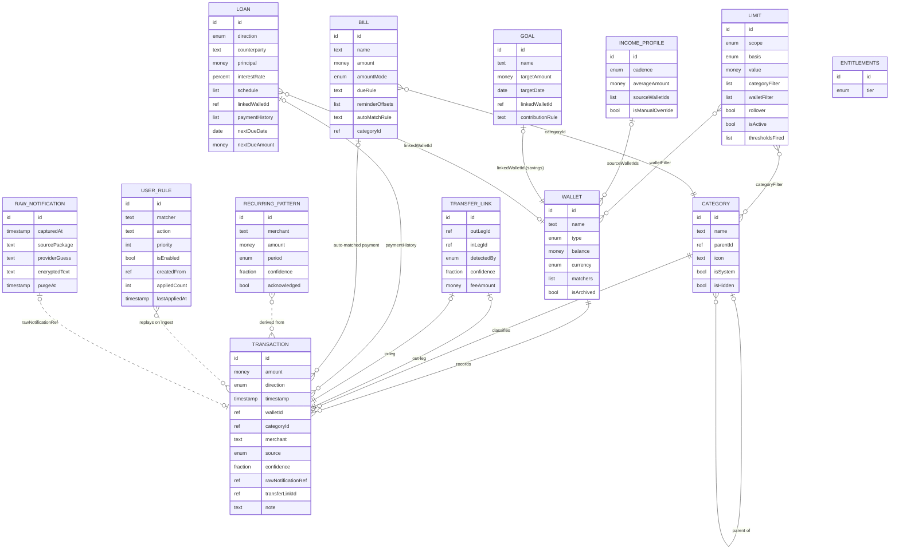

# Domain Model

This document expands the PeraPlano domain model into a full specification: every entity's purpose, fields with types and semantics, relationships, lifecycle (what creates, updates, archives, and deletes each record), and the invariants that keep the ledger trustworthy. It is the reference that all feature docs, the ingest pipeline spec, and the monetization doc must stay consistent with — same entity names, same field names, same rules. It describes behavior and constraints only; it does not prescribe storage or implementation technology.

**Status:** Draft v1 · 2026-08-02

---

## 1. How to read this document

### 1.1 Type vocabulary

Planning-level types only. No storage technology is implied.

| Type | Meaning |
|---|---|
| `id` | Stable unique identifier for a record |
| `ref<Entity>` | Reference to another entity's `id` |
| `text` | Free-form or normalized text |
| `money` | A peso amount, displayed as `₱1,234.56`; always PHP in MVP |
| `timestamp` | A point in time (date + time, device-local) |
| `date` | A calendar date |
| `enum` | One value from a fixed set |
| `bool` | True/false |
| `fraction` | Decimal in the range 0..1 |
| `percent` | Decimal in the range 0..100 |
| `list<T>` | Ordered collection of `T` |

### 1.2 Common fields

Every entity implicitly carries `id`, `createdAt`, and `updatedAt`. These are not repeated in the field tables below.

### 1.3 Terminology

This doc uses the locked product vocabulary throughout: **Wallet** (never "account" as an entity name), **Limit** (never "budget"), **Review Queue** (never "pending" or "inbox"), **Safe-to-Spend**, **Transfer Link**, **Plus**, **Ingest**. Filipino terms are defined on first use.

### 1.4 Related docs

- Ingest stages that create and mutate these records: [03-ingest-pipeline.md](./03-ingest-pipeline.md)
- Feature-level behavior: the docs under [04-features/](./04-features/)
- Gating and entitlement design: [05-monetization.md](./05-monetization.md)
- Data retention and privacy obligations: [07-privacy-and-compliance.md](./07-privacy-and-compliance.md)

---

## 2. Entity relationship diagram

Dashed lines are derived or pipeline relationships (no stored foreign key on both sides); solid lines are stored references.

---

## 3. Entities

### 3.1 Wallet

**Purpose.** A user-named money location — the "where" of every peso. Wallets model banks, e-wallets, physical cash, credit lines, and savings pots. Every Transaction belongs to exactly one Wallet.

**Fields.**

| Field | Type | Semantics |
|---|---|---|
| `name` | `text` | User-facing label, e.g., "BPI Payroll", "GCash", "Cash on hand". Unique among non-archived Wallets. |
| `type` | `enum: bank \| e-wallet \| cash \| credit \| savings` | Drives behavior: `cash` Wallets receive reconciliation prompts and have no matchers; `savings` Wallets can back a Goal; `credit` Wallets represent an owed balance (see semantics below). |
| `balance` | `money` | Current balance. Anchored by the opening balance the user sets at creation (or the latest reconciliation), then moved by every committed Transaction. For `credit` Wallets the balance is zero or negative, rendered in UI as "₱X owed". |
| `currency` | `enum: PHP` | Fixed to PHP in MVP. Held as a field so records remain well-formed if multi-currency ever ships (v2 backlog). |
| `matchers[]` | `list<matcher>` | Which notification sources map to this Wallet. Each matcher: a provider identity (posting app package or SMS sender ID relayed via the default SMS app's notifications) plus an optional distinguishing hint (e.g., last 4 digits of the provider-side account number, or a keyword). Used by Ingest to route parsed notifications. |
| `isArchived` | `bool` | Archived Wallets keep their full history, stop matching notifications, are excluded from pickers and Safe-to-Spend, and freeze their balance. |

**Matcher semantics.** Two Wallets may listen to the same provider only if their matchers carry distinguishing hints (e.g., two BPI Wallets distinguished by last-4). If Ingest cannot resolve a parse to exactly one Wallet, the item goes to the Review Queue rather than being guessed (see [03-ingest-pipeline.md](./03-ingest-pipeline.md)).

**Relationships.** Has many Transactions. May be referenced by: `Goal.linkedWalletId` (savings type only), `Loan.linkedWalletId`, `Limit.walletFilter`, `IncomeProfile.sourceWalletIds`.

**Lifecycle.**

- **Created by:** onboarding provider/wallet setup; the Wallets tab; or inline from a Review Queue item ("Which wallet is this?").
- **Updated by:** user edits (name, type, matchers); every ledger commit that touches it (balance); cash reconciliation (balance anchor reset).
- **Archived by:** user action. Always available; no preconditions.
- **Deleted by:** user action, only after its Transactions are reassigned to another Wallet — the app offers archive as the default alternative. A Wallet referenced by an active Goal or Loan must be unlinked first.

**Entity invariants.**

1. `name` is unique among non-archived Wallets.
2. `cash` Wallets have an empty `matchers[]` (physical cash produces no notifications; it is fed by manual entry and reconciliation).
3. An archived Wallet's matchers never route a notification.
4. A Wallet is never deleted while any Transaction still references it (cross-entity invariant I4).

**Tier note.** Free cap: 3 Wallets. See §6 for the exact matrix and gate behavior.

---

### 3.2 Transaction

**Purpose.** A single money movement — the atomic ledger record. The core promise means Transactions are almost always machine-created from notifications; manual entry exists mainly for cash.

**Fields.**

| Field | Type | Semantics |
|---|---|---|
| `amount` | `money` | Always positive; `direction` carries the sign. |
| `direction` | `enum: in \| out` | Money received vs money spent/sent. |
| `timestamp` | `timestamp` | When the money moved: parsed from the notification when present, otherwise the capture or entry time. |
| `walletId` | `ref<Wallet>` | Required. Exactly one Wallet (cross-entity invariant I1). |
| `categoryId` | `ref<Category>` | Required; defaults to the system category Uncategorized when the Categorizer has no answer. |
| `merchant` | `text` | Normalized counterparty or merchant name (e.g., "Jollibee", "JUAN D"). May be empty when unparseable. |
| `source` | `enum: notification \| manual \| recurring-rule \| import` | Provenance. `notification` = Ingest; `manual` = user entry; `recurring-rule` = posted by a recurring mechanism; `import` = bulk import. **`recurring-rule` and `import` are reserved values: no MVP feature emits them** (Bills never post expected Transactions in MVP, and no import capability is in MVP scope); they are defined now so the enum, CSV export, and lifecycle table stay stable when their creating features ship (v2 consumers include the iOS/import paths in [09-v2-backlog.md](./09-v2-backlog.md)). |
| `confidence` | `fraction` | Parse confidence at commit time. Manual entries are 1.0. Auto-committed records carry the ConfidenceGate score for transparency. |
| `rawNotificationRef?` | `ref<RawNotification>` | Optional. Present on notification-sourced records while the raw capture is retained; cleared when the 30-day purge removes the capture (cross-entity invariants I3, I5). |
| `transferLinkId?` | `ref<TransferLink>` | Optional. Set when this Transaction is a leg of a Transfer Link. |
| `note?` | `text` | Optional user note. |

**Relationships.** Belongs to one Wallet and one Category. At most one Transfer Link. May appear in exactly one Loan's `paymentHistory[]` and be matched to at most one Bill cycle.

**Lifecycle.**

- **Created by:** the ConfidenceGate auto-commit (high-confidence parse); a Review Queue confirmation (low-confidence parse the user approved); manual entry; a recurring rule; import.
- **Updated by:** user corrections — recategorize, edit merchant/note, reassign Wallet (each correction can offer to become a UserRule); transfer link/unlink (sets/clears `transferLinkId`); the purge job (clears `rawNotificationRef` at day 30).
- **Archived by:** nothing. Transactions are never archived. On the Free tier they age out of *display* beyond 90 days but persist in full (§6).
- **Deleted by:** explicit user deletion only. Deletion recomputes the Wallet balance, all affected Limits, and Safe-to-Spend. Deleting a leg of a Transfer Link dissolves the link and the surviving leg becomes countable again.

**Entity invariants.**

1. `amount` > ₱0.00.
2. A low-confidence parse never becomes a Transaction directly; it must pass through the Review Queue (see §4.2).
3. A transfer-linked Transaction is excluded from spend/income totals, Limits, and reports, but still moves its Wallet's balance (cross-entity invariant I2).
4. An auto-committed Transaction keeps `rawNotificationRef` while the raw text is retained, so the user can always see "why did the app record this?" (cross-entity invariant I5).

**Tier note.** Free history window: 90 days of display/reporting. Data is never deleted by the gate. See §6.

---

### 3.3 TransferLink

**Purpose.** Pairs two Transactions — an out-leg and an in-leg — as one internal movement (e.g., GCash cash-in from BPI). Both legs are excluded from spend and income totals so internal shuffling never inflates the numbers.

**Fields.**

| Field | Type | Semantics |
|---|---|---|
| `outLegId` | `ref<Transaction>` | The out-leg: `direction: out`, the sending Wallet. |
| `inLegId` | `ref<Transaction>` | The in-leg: `direction: in`, the receiving Wallet. |
| `detectedBy` | `enum: auto \| manual` | `auto` = TransferDetector; `manual` = user linked the pair (from the Review Queue or a transaction detail screen). |
| `confidence` | `fraction` | Detector score for auto links; 1.0 for manual links. |
| `feeAmount` | `money` (derived) | `outLeg.amount − inLeg.amount`. Usually ≥ ₱0.00 (the provider's transfer fee); a negative value indicates a credited bonus (e.g., a cash-in promo). Informational only in MVP: shown on the Transfer Link detail, not counted in any spend total — an accepted simplification consistent with invariant I2. |

**Relationships.** Exactly two Transactions, referenced from both directions (`Transaction.transferLinkId` and the two leg fields here).

**Lifecycle.**

- **Created by:** the TransferDetector, automatically, only for exact-amount pairs inside the primary detection window with a single unambiguous pairing; fee-tolerant or extended-window candidates are created only through Review Queue confirmation; or by the user manually (auto-link threshold in [03-ingest-pipeline.md](./03-ingest-pipeline.md) §7).
- **Updated by:** nothing — a Transfer Link is immutable. Re-pairing is modeled as unlink + new link.
- **Archived by:** nothing.
- **Deleted by:** user unlink (both legs revert to countable); automatically when either leg is deleted or edited in a way that breaks the pairing (e.g., direction changed).

**Entity invariants.**

1. Exactly two legs: one `in`, one `out`.
2. The two legs are in different Wallets.
3. A Transaction belongs to at most one Transfer Link.
4. Auto-created links satisfied the detector's auto-link threshold at creation time (exact amount match, primary window, single candidate); Review-Queue-confirmed and manual links are exempt from that threshold.

**Tier note.** Ungated — transfer detection and linking work identically on Free and Plus.

---

### 3.4 Category

**Purpose.** The classification tree for spending and income, seeded with PH-flavored defaults: Food & Dining · Groceries/Palengke · Transport (Grab, Angkas, jeep/bus, MRT/LRT-beep, gas) · Load & Data · Bills & Utilities (Meralco, Maynilad/Manila Water, PLDT/Globe/Converge/DITO) · Rent & Housing · Utang & Loan Payments · Padala/Remittance · Shopping (Shopee, Lazada, TikTok Shop) · Health & Pharmacy · Education & Tuition · Entertainment & Subscriptions · Savings & Investments · Fees & Charges · Uncategorized. ("Utang" = personal debt; "padala" = money sent to family/others — both defined here on first use.)

**Fields.**

| Field | Type | Semantics |
|---|---|---|
| `name` | `text` | Display name. Unique among siblings (same `parentId`). |
| `parentId?` | `ref<Category>` | Absent for top-level categories. Present = subcategory. The tree must be acyclic. |
| `icon` | `text` | A Lucide icon name (the app's brand icon family). |
| `isSystem` | `bool` | True for the shipped defaults. System categories cannot be deleted, renamed, or re-parented — this keeps parser and Categorizer mappings stable. They can only be hidden. |
| `isHidden` | `bool` | Hidden categories disappear from pickers and suggestion surfaces. Historical Transactions keep their category and still report under it. |

**Relationships.** Self-referencing tree via `parentId`. Classifies Transactions. Referenced by `Limit.categoryFilter`, `Bill.categoryId`, and UserRule actions.

**Lifecycle.**

- **Created by:** the default seed on first run (system categories); the user (custom categories, optionally nested).
- **Updated by:** user rename/re-parent/icon change (custom only); hide/unhide (any category except Uncategorized).
- **Archived by:** hiding (`isHidden`) — the model's archival mechanism for categories.
- **Deleted by:** user action, custom categories only. On delete: child categories re-parent to the deleted node's parent (or become top-level), and the deleted category's Transactions are reassigned to its parent if one exists, else to Uncategorized.

**Entity invariants.**

1. No cycles in the parent chain.
2. Uncategorized always exists, is a system category, and can be neither hidden nor deleted (it is the universal fallback target).
3. A system category is never deleted.
4. Deleting a category leaves no dangling `categoryId` on any Transaction, Bill, or Limit filter (references are reassigned or removed as part of the delete).

**Tier note.** Ungated — the full category tree, including custom categories, is available on Free and Plus.

---

### 3.5 Limit

**Purpose.** A spending cap over a period (never called a "budget"). Limits are the control surface that makes passive tracking actionable, and the tightest active Limit anchors Safe-to-Spend.

**Fields.**

| Field | Type | Semantics |
|---|---|---|
| `scope` | `enum: daily \| weekly \| monthly \| annual` | Period anchoring: daily = calendar day; weekly = Monday through Sunday; monthly = calendar month; annual = calendar year. |
| `basis` | `enum: fixed \| percent-of-income` | Fixed peso value vs a percentage of income. |
| `value` | `money` or `percent` | For `fixed`: the cap in pesos (e.g., ₱1,500.00 weekly). For `percent-of-income`: 0–100, resolved to an effective peso cap from the IncomeProfile projected over the Limit's scope; the effective value recomputes whenever the IncomeProfile changes (conversion details in [04-features/03-limits.md](./04-features/03-limits.md)). |
| `categoryFilter?` | `list<ref<Category>>` | Optional. When present, only spend in these categories (including their descendants) counts. Absent = all spend. Per-category Limits are a Plus capability (§6). |
| `walletFilter?` | `list<ref<Wallet>>` | Optional. When present, only spend from these Wallets counts. Absent = all Wallets. Like `categoryFilter`, a Plus capability — filtered Limits generally are Plus (§6). |
| `rollover` | `bool` | When true, unused headroom from the just-ended period carries into the next period. Detailed rollover semantics (caps on accumulation, overspend handling) are owned by [04-features/03-limits.md](./04-features/03-limits.md). |
| `isActive` | `bool` | Inactive Limits keep their configuration but do not count spend, alert, or feed Safe-to-Spend. Needed for the Free tier's "1 active" cap. |
| `thresholdsFired[]` | `list<enum: 50 \| 80 \| 100>` | Per-period alert state. Alert thresholds fire at **50% / 80% / 100%** of the effective value, each at most once per period; the list resets when a new period starts. Thresholds are fixed in MVP, not configurable. |

**Counted spend.** A Transaction counts toward a Limit when: `direction: out`, not transfer-linked, matches `categoryFilter` and `walletFilter` (when present), and its `timestamp` falls in the Limit's current period. Review Queue items do not count (they are not Transactions yet).

**Relationships.** Optional filters to Categories and Wallets. Consumes the IncomeProfile when `basis: percent-of-income`. Feeds Safe-to-Spend ([04-features/09-safe-to-spend.md](./04-features/09-safe-to-spend.md)).

**Lifecycle.**

- **Created by:** the user — the onboarding "first limit" step or the Plan tab.
- **Updated by:** user edits (effective immediately, with a current-period recompute — raising the value can un-trip a threshold); the ledger (every commit recomputes consumption); the period boundary (resets `thresholdsFired[]`, applies rollover); IncomeProfile changes (recompute effective value for percent basis).
- **Archived by:** deactivation (`isActive: false`) — configuration retained.
- **Deleted by:** user action. No ledger impact; only the cap and its alerts disappear.

**Entity invariants.**

1. `value` > 0 (pesos or percent).
2. A `percent-of-income` Limit requires an IncomeProfile with usable values; if the IncomeProfile is cleared, such Limits deactivate with an in-app explanation rather than silently computing from nothing.
3. Each threshold (50/80/100) fires at most once per period.
4. Transfer-linked Transactions never count (cross-entity invariant I2).

**Tier note.** Free cap: 1 active Limit, unfiltered — `categoryFilter` and `walletFilter` are Plus ("per-category" in the matrix covers filtered Limits generally). See §6.

---

### 3.6 IncomeProfile

**Purpose.** The user's income rhythm — detected from the ledger or declared during onboarding. It feeds percent-of-income Limits and payday auto-allocation (Plus). "Kinsenas/katapusan" is the PH semi-monthly payday pattern: kinsenas = payday on the 15th, katapusan = payday at month-end (the 30th), so salaries land on the 15th and 30th.

**Fields.**

| Field | Type | Semantics |
|---|---|---|
| `cadence` | `enum: kinsenas (15th/30th) \| weekly \| monthly \| irregular` | The pay rhythm. `irregular` covers gig income, sari-sari store proceeds, mixed sources. |
| `averageAmount` | `money` | Average income **per pay event**. Monthly-equivalent income is derived: kinsenas × 2, weekly × ~4.33, monthly × 1; `irregular` uses a trailing 90-day average. Derivation details in [04-features/04-income.md](./04-features/04-income.md). |
| `sourceWalletIds[]` | `list<ref<Wallet>>` | The Wallets where income lands. Detection watches `in`-direction, non-transfer-linked Transactions in these Wallets. |
| `isManualOverride` | `bool` | True when the user declared or edited the values; detection then stops overwriting them until the user re-enables automatic detection. |

**Derived values.** Next expected payday (from `cadence`), monthly-equivalent income (for percent-of-income Limits), payday trigger events (for Plus payday auto-allocation).

**Relationships.** References source Wallets. Consumed by `percent-of-income` Limits and by `Goal.contributionRule`.

**Lifecycle.**

- **Created by:** the onboarding income declaration, or the first confident cadence detection if the user skipped that step.
- **Updated by:** the detection job refining `cadence`/`averageAmount` while `isManualOverride` is false; user edits (which set `isManualOverride: true`).
- **Archived by:** nothing.
- **Deleted by:** nothing directly. The user can clear its values; clearing deactivates any `percent-of-income` Limits and suspends payday triggers, each with an in-app explanation.

**Entity invariants.**

1. Exactly one IncomeProfile exists per user (MVP).
2. While `isManualOverride` is true, detection never overwrites user-declared values.

**Tier note.** Ungated — the IncomeProfile serves both tiers (the Free tier's single active Limit may use `percent-of-income`). Payday auto-allocation, which consumes it, is Plus (§6).

---

### 3.7 Goal

**Purpose.** A savings target backed by a savings Wallet — e.g., "Emergency fund, ₱30,000.00 by December 15". Progress is real money in a real Wallet, not a virtual counter.

**Fields.**

| Field | Type | Semantics |
|---|---|---|
| `name` | `text` | e.g., "Emergency Fund", "Motor down payment". |
| `targetAmount` | `money` | > ₱0.00. |
| `targetDate?` | `date` | Optional deadline; used for pacing displays ("save ₱X per payday to make it"). |
| `linkedWalletId` | `ref<Wallet>` | Required; must reference a Wallet of `type: savings`. Progress = that Wallet's current balance, floored at ₱0.00 and capped at `targetAmount` for display. |
| `contributionRule?` | `text` (structured) | Optional, **Plus**: auto-allocate ₱X or X% of income on payday. The app cannot move real money — on payday it records the planned contribution, prompts the user to make the transfer, and marks the contribution fulfilled when the matching transfer into the savings Wallet is detected. Planned contributions are subtracted in the Safe-to-Spend formula. |

**Relationships.** Linked one-to-one with a savings Wallet. `contributionRule` consumes the IncomeProfile's payday trigger.

**Lifecycle.**

- **Created by:** the user in the Plan tab, with an inline option to create the backing savings Wallet in the same flow.
- **Updated by:** user edits (target, date, rule); every ledger commit touching the linked Wallet (progress recompute). A Goal reaches the derived state "achieved" when the linked Wallet's balance ≥ `targetAmount`.
- **Archived by:** nothing formal — an achieved Goal remains visible as achieved until the user deletes it.
- **Deleted by:** user action. The linked savings Wallet and its Transactions are untouched.

**Entity invariants.**

1. `linkedWalletId` references a `savings` Wallet.
2. A savings Wallet backs at most one Goal (prevents double-counting the same pesos toward two targets).
3. `targetAmount` > ₱0.00.

**Tier note.** Free cap: 1 Goal; `contributionRule` (payday auto-allocate) is Plus. See §6.

---

### 3.8 Loan

**Purpose.** Debt tracking in both directions. "I owe": GLoan, credit cards, Home Credit, "5-6" (informal street lending — borrow ₱5, repay ₱6, i.e., 20% flat interest), personal utang. "Owed to me": personal lending to friends and family. Payments are matched from the ledger so the balance stays honest without manual bookkeeping.

**Fields.**

| Field | Type | Semantics |
|---|---|---|
| `direction` | `enum: i-owe \| owed-to-me` | Which way the debt runs. |
| `counterparty` | `text` | The person or institution on the other side. |
| `principal` | `money` | The original amount borrowed/lent. |
| `interestRate?` | `percent` | **ANNUAL percent, and not informational.** It is what an amortized `schedule` is computed from: `lib/loans/loan_math.ts` reads it per annum (`rate / 100 / 12` for the monthly rate) to derive the level installment and each row's principal/interest split, so a monthly figure stored here inflates the whole schedule roughly twelvefold. Used only by the amortized type ([04-features/06-loans.md](./04-features/06-loans.md) rules 1 and 3). `null` for flat and free-form, which carry no rate at all: 5-6 is modeled as one of those two, and loans rule 4 forbids the app from deriving or displaying a rate for it. |
| `schedule?` | `list<installment>` | Optional amortization schedule; each installment: `{ dueDate, amountDue, principalPortion?, interestPortion? }`. Informal utang often has none. Full schedule view is Plus (§6). |
| `linkedWalletId?` | `ref<Wallet>` | Optional Wallet where payments flow (a `credit` Wallet for cards, an e-wallet for GLoan). Helps payment matching. |
| `paymentHistory[]` | `list<ref<Transaction>>` | Ledger Transactions matched as payments — automatically (merchant/amount/date-window rules) with user confirmation for ambiguous matches, or manually attached from the loan detail. |
| `nextDueDate` | `date` | From the schedule when present; otherwise set manually. Drives reminders. |
| `nextDueAmount` | `money` | From the schedule when present; otherwise set manually. |

**Derived values.** Outstanding balance = `principal` (plus scheduled interest when a schedule exists) − sum of `paymentHistory` amounts. A Loan whose outstanding balance reaches ≤ ₱0.00 enters the derived state "settled" (record kept).

**Relationships.** Optional link to a Wallet. `paymentHistory[]` references Transactions.

**Lifecycle.**

- **Created by:** the user in the Plan tab.
- **Updated by:** payment matching (appends to `paymentHistory[]`, advances `nextDueDate`/`nextDueAmount` when an installment is satisfied); user edits to schedule, counterparty, or dues.
- **Archived by:** settlement (derived state; the record and its history remain).
- **Deleted by:** user action. Matched Transactions are untouched — they simply stop being counted as payments of this Loan.

**Entity invariants.**

1. A Transaction appears in at most one Loan's `paymentHistory[]`.
2. Payment direction is consistent with the Loan: `i-owe` payments are `out` Transactions; `owed-to-me` repayments are `in` Transactions.
3. `principal` > ₱0.00.

**Tier note.** Free cap: 1 Loan with basic tracking (balance + next due); the full amortization schedule view is Plus. Schedule data entered while on Plus is retained through a downgrade. See §6.

---

### 3.9 Bill

**Purpose.** A recurring obligation with due-date reminders and automatic payment matching — Meralco, rent, PLDT, tuition installments. Bills answer "what's coming and is it paid?", and they feed the Safe-to-Spend formula (bills due before the period ends).

**Fields.**

| Field | Type | Semantics |
|---|---|---|
| `name` | `text` | e.g., "Meralco", "Apartment rent". |
| `amount` | `money`, with mode `fixed \| estimated` | The expected peso value each cycle. `fixed` = identical every cycle (rent). `estimated` = expected value recalculated after each matched payment (e.g., the average of the last 3 matched cycles) — right for utilities that vary month to month. |
| `dueRule` | recurrence rule | When the Bill falls due: day-of-month (e.g., every 20th; months lacking that day use the last day), semi-monthly (on the 15th and 30th, aligning with kinsenas), every N weeks, or last-day-of-month. |
| `reminderOffsets[]` | `list<offset>` | When to remind, relative to the due date — e.g., 3 days before and on the due date. Reminders use the app's own notifications (POST_NOTIFICATIONS runtime permission on Android 13+). |
| `autoMatchRule` | match rule | Criteria that link the paying Transaction from the ledger: merchant pattern + amount tolerance (± a percentage or peso band) + a date window around the due date. A match marks the cycle paid. |
| `categoryId` | `ref<Category>` | The category matched payments belong to (typically Bills & Utilities). |

**Per-cycle derived state.** Each due-date occurrence is derived from `dueRule`: *upcoming* → *due* → *paid* (with the matched Transaction) or *missed* (window closed with no match; surfaced for manual resolution).

**Relationships.** References one Category. Matched cycles reference Transactions (one Transaction matches at most one Bill cycle).

**Lifecycle.**

- **Created by:** the user in the Plan tab; or promoted from a RecurringPattern suggestion ("Make this a Bill").
- **Updated by:** user edits; the matcher (marks cycles paid); each match when `amount` is `estimated` (recalculates the estimate).
- **Archived by:** nothing formal — the user can empty `reminderOffsets[]` to silence reminders while keeping tracking.
- **Deleted by:** user action. Reminders stop; previously matched Transactions are untouched.

**Entity invariants.**

1. A Transaction is matched to at most one Bill cycle.
2. A matched paying Transaction has `direction: out` and is not transfer-linked.
3. `amount` > ₱0.00.

**Tier note.** Ungated — Bills, reminders, and auto-match are identical on Free and Plus (Bills are not a row in the tier matrix).

---

### 3.10 RecurringPattern

**Purpose.** A detected subscription or recurring spend — the engine behind "₱X/month locked in." Derived entirely from Transaction history; it can always be recomputed.

**Fields.**

| Field | Type | Semantics |
|---|---|---|
| `merchant` | `text` | The recurring counterparty (e.g., a streaming service, a load promo). |
| `amount` | `money` | The typical charge, matched within a tolerance band. |
| `period` | `enum` | The detected interval: weekly, monthly, annual (and similar). |
| `confidence` | `fraction` | Detection confidence; rises with consistent instances, decays when an expected instance is missed. |
| `acknowledged` | `bool` | True once the user confirms this is a real recurring commitment. Only acknowledged patterns roll into the headline "₱X/month locked in" figure; unacknowledged detections surface as suggestions to confirm or dismiss. |

**Relationships.** Derived from groups of Transactions (no stored back-references needed). Can be promoted into a Bill.

**Lifecycle.**

- **Created by:** the detection job, after at least 3 instances at a consistent interval and amount.
- **Updated by:** new matching instances (amount drift, confidence up); missed instances (confidence decay).
- **Archived by:** nothing — low-value records are removed, not archived.
- **Deleted by:** user dismissal (which records a suppressing UserRule so detection does not re-surface the same pattern) or automatic removal when confidence decays below the floor after repeated missed periods. Because the entity is derived, deletion never loses ledger data.

**Entity invariants.**

1. RecurringPattern is derived data: deleting or rebuilding it never changes any Transaction.
2. A dismissed pattern is not re-surfaced (enforced via its suppressing UserRule).

**Tier note.** Recurring/subscription detection is Plus-only in the tier matrix (§6). Surfacing is gated at the Entitlements call-site; because the entity is derived, a Free user who upgrades sees patterns computed from their full retained history immediately.

---

### 3.11 UserRule

**Purpose.** A correction the user made once, replayed forever. Every Review Queue fix can become a UserRule (e.g., "merchant JUAN D → category Utang & Loan Payments", "GCash notif matching X → wallet Y"), which turns parser gaps into training data instead of bug reports.

**Fields.**

| Field | Type | Semantics |
|---|---|---|
| `matcher` | match conditions | What the rule tests against a normalized parse: any of provider identity, merchant text pattern, direction, amount range. |
| `action` | rule action | One of: set category; set Wallet; set/normalize merchant name; mark as transfer candidate; suppress a RecurringPattern from re-surfacing; ignore (never ledger this — for notifications the user flagged as not money movements, e.g., promotional pushes). |
| `priority` | `int` | Evaluation order. Later-created rules evaluate first; the first matching rule per action type wins. |
| `isEnabled` | `bool` | The user can disable a rule without deleting it. |
| `createdFrom` | `ref` | The originating correction (the Review Queue item or Transaction), kept for explainability — "this rule exists because you corrected X on June 12". |
| `appliedCount` | `int` | Transparency stat: how many times the rule has fired. |
| `lastAppliedAt` | `timestamp` | Transparency stat: when it last fired. |

**Relationships.** Consulted by Ingest — during Wallet resolution and at the Categorizer stage (merchant map → **UserRules** → learned suggestions → Uncategorized; see [03-ingest-pipeline.md](./03-ingest-pipeline.md)). Actions may reference Categories and Wallets.

**Lifecycle.**

- **Created by:** Review Queue actions (primary path); corrections on committed Transactions where the user chooses "always do this".
- **Updated by:** the pipeline (stats fields); the user (edit, enable/disable) from the transparency/parser-diagnostics screens ([04-features/11-settings-privacy.md](./04-features/11-settings-privacy.md)).
- **Archived by:** disabling (`isEnabled: false`).
- **Deleted by:** user action only.

**Entity invariants.**

1. Every UserRule is traceable to `createdFrom`.
2. Rules replay on future ingests only; applying a new rule retroactively to past Transactions is a one-time, explicitly confirmed bulk action — rules never silently rewrite committed history.
3. A rule whose action references a deleted Category or Wallet is automatically disabled with an in-app notice, never silently repointed.

**Tier note.** Ungated — corrections and rule replay are core tracking quality, available on Free and Plus.

---

### 3.12 Entitlements

**Purpose.** The single feature-flag layer that answers tier questions at feature call-sites ("may this user create another Wallet?", "may they see the Safe-to-Spend projection?"). All features ship built and working in MVP; gating is defined now and enforced later through this one layer.

**Fields.**

| Field | Type | Semantics |
|---|---|---|
| `tier` | `enum: free \| plus` | The user's tier. **Hardcoded `plus` during MVP** — no gate fires. Billing-related fields (entitlement source, expiry) are intentionally out of MVP scope; [05-monetization.md](./05-monetization.md) frames how they arrive with enforcement. |

**Relationships.** None stored. Every gated call-site reads it; it references nothing.

**Lifecycle.**

- **Created by:** first run (singleton, `tier: plus` in MVP).
- **Updated by:** the enforcement/billing phase after MVP.
- **Archived / deleted by:** nothing — the singleton always exists.

**Entity invariants.**

1. Exactly one Entitlements record exists.
2. Gating decisions are made only by evaluating this record at call-sites — no feature hardcodes tier behavior elsewhere.

---

## 4. Supporting records

These are not first-class §3 entities, but the model references them and their rules matter.

### 4.1 RawNotification capture

The on-device store behind `Transaction.rawNotificationRef`, holding the raw text of captured notifications so the user can always audit "why did the app record this?".

| Field | Type | Semantics |
|---|---|---|
| `capturedAt` | `timestamp` | When the notification was captured by the listener. |
| `sourcePackage` | `text` | The posting app's package (e.g., an e-wallet app, or the default SMS app relaying a bank text). |
| `providerGuess` | `text` | The SourceRouter's provider identification, or "unknown" for unknown-bin captures. |
| `encryptedText` | `text` | The raw notification text, encrypted at rest on-device. |
| `purgeAt` | `timestamp` | `capturedAt` + 30 days. A scheduled job deletes the record at this time and clears `rawNotificationRef` on any Transaction pointing to it. |

Rules:

1. Raw notification text **never** leaves the phone: it is excluded from cloud backup, export, and telemetry, on every tier, without exception.
2. Purge after 30 days is unconditional (cross-entity invariant I3).
3. Unknown-provider captures (the unknown-bin) live here too, so the user can flag "this is a money notification" in the Review Queue, feeding future parser coverage.

*Illustrative sample — not a verified format; real formats are captured from devices during implementation and maintained as a versioned parser corpus:* a relayed bank SMS notification might read "BPI: You received PHP 5,000.00 via InstaPay from JUAN D on 2026-08-02." All such samples in planning docs are illustrative.

### 4.2 Review Queue item (uncommitted candidate)

An uncommitted ledger candidate awaiting the user's confirmation — a low-confidence parse, an unknown-provider capture, or an ambiguous transfer pairing. Review Queue items are **not** Transactions:

1. They are excluded from all totals, balances, Limits, and Safe-to-Spend (an accepted simplification, stated in the Safe-to-Spend definition).
2. They carry the parsed candidate fields (amount, direction, merchant, Wallet guess, category guess, confidence), a `reason` (`low-confidence | unknown-provider | ambiguous-transfer | possible-duplicate`), and a `rawNotificationRef`.
3. On confirmation (one or two taps) they become a real Transaction, optionally spawning a UserRule from the correction. On dismissal they are discarded; the raw capture remains until its normal purge.
4. The queue's badge count appears on the Transactions tab.

Triage UX is owned by [04-features/08-review-queue.md](./04-features/08-review-queue.md).

---

## 5. Cross-entity invariants

The canonical five (I1–I5) are locked; I6 onward are their necessary consequences, consolidated from the entity sections. All are testable.

| # | Invariant |
|---|---|
| I1 | A Transaction belongs to exactly one Wallet. |
| I2 | Transfer-linked transactions never count in spend/income totals, limits, or reports (they do affect wallet balances). |
| I3 | Raw notification text never syncs and is purged after 30 days. |
| I4 | Deleting a Wallet requires reassigning or archiving its Transactions (no orphan transactions). |
| I5 | Every auto-committed Transaction keeps `rawNotificationRef` while raw text is retained, so the user can always see "why did the app record this?" |
| I6 | `Transaction.amount`, `Limit.value`, `Goal.targetAmount`, `Loan.principal`, and `Bill.amount` are all strictly positive; `direction` fields carry the sign. |
| I7 | A Transfer Link has exactly two legs — one `in`, one `out` — in different Wallets; a Transaction belongs to at most one Transfer Link. |
| I8 | The category tree is acyclic; Uncategorized always exists and cannot be hidden or deleted; system categories are never deleted; no deletion leaves a dangling `categoryId` anywhere. |
| I9 | Exactly one IncomeProfile exists; a `percent-of-income` Limit deactivates (with explanation) when the IncomeProfile has no usable values. |
| I10 | A Goal's `linkedWalletId` is a `savings` Wallet, and a savings Wallet backs at most one Goal. |
| I11 | Limit alert thresholds (50% / 80% / 100%) each fire at most once per period. |
| I12 | A Transaction appears in at most one Loan's `paymentHistory[]`, with direction consistent with the Loan's direction; a Transaction matches at most one Bill cycle. |
| I13 | Review Queue items are not Transactions and are excluded from every total until confirmed. |
| I14 | Derived records (RecurringPattern, per-cycle Bill states, Goal progress, Safe-to-Spend values) can always be rebuilt from the ledger; deleting them never loses user data. |
| I15 | Every UserRule is traceable to the correction that created it, and rules never silently rewrite committed history. |
| I16 | Tier caps block creation of new records only; enforcement never deletes, modifies, or hides-then-discards existing user data (see §6). |

---

## 6. Free tier caps and the domain model

Gating is enforced (post-MVP) solely through the Entitlements layer, evaluated at feature call-sites. The tier matrix is reproduced here exactly:

| Capability | Free | Plus |
|---|---|---|
| Auto-tracking (notification ingest) | Unlimited | Unlimited |
| Wallets | 3 | Unlimited |
| Limits | 1 active | Unlimited + per-category |
| Goals | 1 | Unlimited + payday auto-allocate |
| Loans | 1, basic tracking (balance + next due) | Unlimited + full amortization schedule |
| History | 90 days | Unlimited |
| Reports | Basic monthly | Full + trends + custom range |
| Export | — | CSV (PDF later) |
| Cloud backup / multi-device sync | — | ✓ |
| Recurring/subscription detection | — | ✓ |
| Safe-to-Spend | Today only | Projected to end of period |

**Gate principles (apply everywhere, always):**

1. **Caps block creation, never delete data.** Hitting a cap blocks creating a *new* record and shows the upgrade path. Nothing existing is ever deleted, truncated, or corrupted by a gate.
2. **Downgrade keeps everything.** A user who had Plus and lapses keeps every record; records beyond a Free cap remain visible and functional — only creation of additional ones is blocked (Limits are the one nuance: extras deactivate, see below).
3. **Derived data recomputes.** Plus-only derived views (projections, patterns, full reports) reappear on upgrade, computed from the retained history.

**Entity-by-entity gate behavior:**

| Entity | Free cap (from the matrix above) | Behavior at the gate |
|---|---|---|
| Wallet | 3 | Creating a 4th Wallet is blocked with an upgrade prompt. All existing Wallets — including more than 3 after a downgrade — stay fully functional and keep ingesting (auto-tracking is Unlimited on Free). |
| Transaction | History: 90 days | Ingest never stops. Records older than 90 days are hidden from display and reports on Free but fully retained; upgrading restores the entire history instantly. No Transaction is ever deleted by the gate. |
| TransferLink | Ungated | Identical on both tiers. |
| Category | Ungated | Identical on both tiers, including custom categories. |
| Limit | 1 active | Creating or activating a second Limit is blocked; the user may swap which Limit is active at any time. On downgrade, the most recently edited active unfiltered Limit stays active by default (deterministic, user-swappable, no forced choice); the rest become inactive (`isActive: false`) with configuration retained. `categoryFilter` and `walletFilter` require Plus ("per-category" in the matrix covers filtered Limits generally); a downgraded filtered Limit deactivates rather than losing its filter. |
| IncomeProfile | Ungated | Serves both tiers. Its payday triggers only drive auto-allocation on Plus. |
| Goal | 1 | Creating a 2nd Goal is blocked. Goals beyond the cap after a downgrade remain visible with live progress (derived from Wallet balances); `contributionRule` (payday auto-allocate) suspends on Free and resumes on upgrade. |
| Loan | 1, basic tracking (balance + next due) | Creating a 2nd Loan is blocked; existing extras remain visible with balance + next due. The amortization `schedule` is retained but its full view/pacing features show only on Plus. Payment matching keeps running on all Loans (it protects data quality). |
| Bill | Ungated | Identical on both tiers. |
| RecurringPattern | Plus-only (Recurring/subscription detection) | Surfacing is gated at the call-site. Because patterns are derived, nothing is lost on Free; on upgrade, detection results appear computed from the full retained history. Dismissal-suppression UserRules persist across tier changes. |
| UserRule | Ungated | Corrections and replay are core tracking quality on both tiers. |
| Entitlements | — | The gate mechanism itself; hardcoded `plus` during MVP so no gate fires. |

Report depth, CSV export, cloud backup / multi-device sync, and the Safe-to-Spend projection rows of the matrix gate *features over* this data rather than the entities themselves; their behavior is specified in [04-features/10-reports.md](./04-features/10-reports.md), [04-features/09-safe-to-spend.md](./04-features/09-safe-to-spend.md), and [05-monetization.md](./05-monetization.md). One boundary is tier-independent and absolute: RawNotification captures never sync and never export, on any tier (invariant I3).

---

## 7. Data lifecycle, retention, and the sync boundary

| Record | Retention | Cloud backup eligibility (Plus, opt-in) |
|---|---|---|
| RawNotification capture | 30 days, then unconditionally purged | **Never.** On-device only; excluded from backup, export, and telemetry. |
| Transaction | Indefinite (Free displays 90 days; data retained) | Yes — committed Transaction records sync encrypted when the user enables cloud backup. |
| Wallet, Category, Limit, IncomeProfile, Goal, Loan, Bill, UserRule | Indefinite, user-controlled | Yes — user-authored configuration is included in the encrypted backup when enabled. |
| TransferLink | Indefinite (follows its legs) | Yes — with its legs. |
| RecurringPattern, per-cycle Bill states, Goal progress, Safe-to-Spend values | Derived; rebuilt at any time | No — recomputed on each device from the ledger, never synced. |
| Review Queue items | Until confirmed (becomes a Transaction) or dismissed | No — uncommitted candidates are device-local. |
| Entitlements | Singleton, permanent | Governed by the billing/entitlement system post-MVP, not by user backup. |

The user's full-control operations — export everything, wipe everything, pause listening, view every capture — operate over this same model and are specified in [04-features/11-settings-privacy.md](./04-features/11-settings-privacy.md) and [07-privacy-and-compliance.md](./07-privacy-and-compliance.md).
