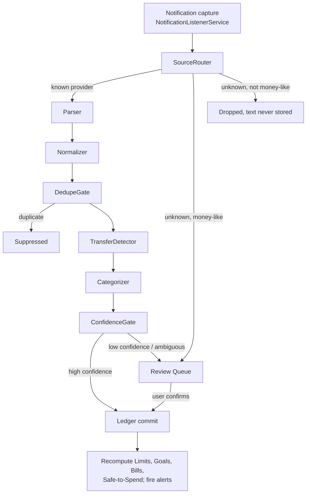

# Ingest Pipeline

This document specifies PeraPlano's Ingest pipeline — the notification → ledger pipeline that delivers the core promise: *you never log a transaction; you only set the rules.* It defines every stage's inputs, outputs, rules, and failure modes; the Philippine provider catalogue the pipeline targets; the deduplication and transfer-detection rules; the parser-as-versioned-data model; the Android platform constraints the pipeline lives under; and the confidence scoring that decides what auto-commits and what routes to the Review Queue. The pipeline is the product's moat: everything else in the app is a view over the ledger this pipeline produces.

**Status:** Draft v1 · 2026-08-02 · MVP amendments 2026-09-05 (§5 rule 5, §6 rule 5, §11.2 rules 2 and 4)

---

## 1. Pipeline overview

The canonical stage order is locked. Every notification event flows through these stages in this order; no stage is skipped, though several stages can short-circuit an event out of the pipeline (drop, suppress, or route to the Review Queue).

Design principles that govern every stage:

1. **Conservative by default.** When the pipeline is unsure, it asks (Review Queue) rather than guesses. A wrong auto-committed Transaction corrupts totals and destroys trust; a Review Queue item costs one tap.
2. **Never lose money-like signal.** Anything that might be a transaction is retained (encrypted, on-device, 30-day TTL) even when it cannot be parsed. Anything that is clearly not money-related is dropped immediately, and its text is never stored. It does leave a minimal record, its app and its times and nothing else, under the same 30-day TTL, so a miss by the money-signal heuristic can still be found in the Privacy centre (owner decision 2026-09-09, extended to the live path on 2026-09-24; GAP-107). Both paths behave the same way, whether the notification arrived while the app was running or was drained from the native buffer afterwards. A package the user has muted is the one exception and leaves nothing at all: they have already said it is not money.
3. **Corrections become rules.** Every user correction in the Review Queue produces a **UserRule** that replays on future notifications. Parser gaps become training data instead of bug reports.
4. **Raw text never leaves the phone.** Only structured, committed Transaction records ever sync (and only if the user enables cloud backup, a Plus feature). Telemetry about the pipeline is aggregate counts only — never content.
5. **No true backfill exists.** Android provides no API to replay notifications that were posted and dismissed while the listener was down. On reconnection, the listener can read a snapshot of notifications still present in the status bar and feed them through the normal pipeline as a partial catch-up; anything dismissed or auto-cancelled during the gap is permanently gone. The mitigation for the truly lost remainder is reconciliation (§12.4), not replay.

---

## 2. Stage 0 — Notification capture (`NotificationListenerService`)

**Input:** every status-bar notification posted on the device, delivered by the Android `NotificationListenerService` once the user has granted Notification Access.

**Output:** a captured notification event — source package name, post timestamp, notification key, and extracted text fields (title, body, expanded text where present) — handed to the SourceRouter.

**Rules:**

1. The listener runs 24/7 and re-registers after device reboot via a boot receiver.
2. The app's own notifications (limit alerts, bill reminders, listener-health notices) are ignored by the listener.
3. Silent and low-priority notifications are captured; several providers post transaction alerts silently.
4. Updates to an existing notification (same notification key re-posted) are treated as an update to the prior event, not a new event.
5. The event timestamp is the notification's post time, not the pipeline's processing time.
6. Capture must be non-blocking and crash-isolated: a failure processing one notification must never take down the listener.
7. The listener records a heartbeat (last-capture and last-alive timestamps) that feeds the listener-health indicator (§12.3).

**Failure modes:**

| Failure | Effect | Mitigation |
|---|---|---|
| User revokes Notification Access | Pipeline fully stops | Health indicator turns red; app surfaces "tracking is off" state; re-grant flow (§12.1) |
| System disconnects the listener (memory pressure, OEM policy) | Silent gap in capture | Request rebind on detection; heartbeat gap triggers "tracking was interrupted" banner (§12.4) |
| OEM battery manager kills the process | Silent gap in capture | Battery-optimization exemption prompt + OEM-specific guidance (§12.3); reconciliation on next open |
| Notification posted during a gap | Missed unless still present in the status bar at reconnection | Active-notification snapshot catch-up on reconnect (§1, principle 5); reconciliation prompts; balance-after cross-check where providers include it |
| Notification with no extractable text (custom layout, image-only) | Nothing to parse | Counted in telemetry (count only); routed to unknown-bin handling if money-like signal exists in any text field |
| Grouped/summary notification hides per-transaction detail | Partial or merged text | Parser templates for group summaries where feasible; otherwise low confidence → Review Queue |

---

## 3. Stage 1 — SourceRouter

**Input:** a captured notification event.

**Output:** one of three routes — (a) tagged with a known provider identity and passed to the Parser; (b) recognized as the default SMS app and passed through the SMS-relay sub-route; (c) unknown source, either retained to the unknown-bin (money-like) or dropped (not money-like).

**Rules:**

1. Routing is by source package name matched against the provider catalogue (§10). Package names in the catalogue are indicative and must be verified at implementation.
2. **SMS-relay sub-route:** notifications posted by the default SMS app are inspected for known bank sender-ID prefixes ("BPI", "BDO", "MB", "LBP", and the rest of the catalogue's SMS-capable providers). A match routes the event to that bank's Parser rules with channel = SMS-via-Messages. The app never reads SMS directly (§12.2).
3. **Unknown-bin pre-filter (data minimization):** an event from an unknown package is retained only if it is money-like — its text contains a currency marker (₱, "PHP", "Php") or an amount-shaped pattern. Everything else is dropped immediately and its text is never stored. This keeps chat messages, social notifications, and other private content out of the app entirely. What such a notification does leave is its app and its times, as principle 2 describes, on either path.
4. Unknown-bin items are stored encrypted on-device with the same 30-day TTL as all raw notification text, and surface in a collapsed "Other captured notifications" area of the Review Queue where the user can flag "this is a money notification." A flag sends only the package name and a parse-gap signal (never content) so the team can prioritize new parser coverage.
5. Super-app packages (Shopee carrying ShopeePay, Grab carrying GrabPay) route to their provider's Parser, which is responsible for rejecting the high volume of non-transactional (marketing) notifications those apps emit.

**Failure modes:**

| Failure | Effect | Mitigation |
|---|---|---|
| Provider ships under a variant package name (regional build, rebrand) | Money notifications land in unknown-bin | Money-like pre-filter retains them; user flag + remote-updatable routing table (§11) adds the package without an app release |
| Default SMS app differs by OEM or user choice | Bank SMS relay missed | Routing table lists common default SMS app packages; unknown-bin catches the rest via sender-ID text in a money-like notification |
| Marketing push from a money app | Parser load and false-positive risk | Parser template classification drops non-transactional events (§4) |
| Money notification without a currency marker | Dropped by pre-filter | Accepted residual risk; tracked as an open question (§14). It leaves its app and time in the Privacy centre on either path, so the miss can be found (principle 2) |

---

## 4. Stage 2 — Parser

**Input:** a routed event with a provider identity and channel (push or SMS-via-Messages).

**Output:** a raw parse — event type (send, receive, pay, cash-in, cash-out, load, refund, interest, disbursement, payment), candidate field strings (amount, counterparty/merchant, reference number, balance-after), the matched template's identity and version, and a template match strength.

**Rules:**

1. Parsing is rule-driven: per-provider packs of regex- and template-based rules, **versioned and shipped as data, not code** (full model in §11). Rules are declarative pattern definitions; no remotely delivered executable logic exists anywhere in the pipeline.
2. Each provider pack is an ordered list of templates. The first template that fully matches wins; partial matches are recorded with reduced match strength.
3. Templates classify every event, including non-transactional ones: OTP messages, marketing, balance inquiries, and login alerts are classified and dropped (counted in aggregate telemetry, content never recorded beyond the standard raw store).
4. A parse failure must never crash or stall the pipeline. An event from a known provider that matches no template becomes a low-confidence capture routed toward the Review Queue, and increments that provider's parse-miss counter (count only).
5. Every parse records which template and pack version produced it, so parser regressions can be traced and rolled back (§11).

**Failure modes:**

| Failure | Effect | Mitigation |
|---|---|---|
| Parser rot — provider silently changes wording | Template misses spike | Parse-miss telemetry (counts only) alerts the team; Review Queue absorbs affected events; remote pack update fixes without app release |
| Partial match (amount found, direction ambiguous) | Incomplete parse | Reduced match strength → ConfidenceGate routes to Review Queue prefilled |
| Truncated collapsed-notification text | Fields cut off | Templates prefer expanded text when present; truncation-tolerant patterns; otherwise low confidence |
| Two amount-like tokens (amount + balance-after) | Wrong amount risk | Templates bind fields positionally per provider; unresolved ambiguity applies a scoring penalty (§9.1) |

---

## 5. Stage 3 — Normalizer

**Input:** a raw parse.

**Output:** a normalized event: `amount` (numeric, PHP), `direction: in | out`, `merchant` (cleaned), reference number (when present), balance-after (when present), provider, channel, event timestamp, and a resolved `walletId` where possible.

**Rules:**

1. **Amount:** parsed from formats like `₱1,234.56`, `PHP 1,234.56`, and `1234.56`; thousands separators and two-decimal centavos handled; the result is a numeric PHP amount. Currency is PHP only in MVP — any event whose text indicates a non-PHP currency is never auto-committed and routes to the Review Queue.
2. **Direction:** mapped from the parsed event type (send/pay/cash-out/payment → `out`; receive/cash-in/refund/interest/disbursement → `in`). Direction inferred from weak cues rather than an explicit template field carries a scoring penalty (§9.1).
3. **Merchant:** cleaned of trailing reference codes, normalized casing and whitespace. The original string is preserved via `rawNotificationRef` while raw text is retained.
4. **Wallet resolution:** the event is assigned to a Wallet by matching its provider identity and channel against each Wallet's `matchers[]`. One provider can map to multiple Wallets (e.g., a Maya e-wallet Wallet and a Maya savings Wallet) when matchers are qualified by event type. An event whose provider maps to no Wallet routes to the Review Queue with a wallet-assignment prompt; the user's assignment there creates a UserRule (and, if needed, a new Wallet, subject to the wallet gate — §13).
5. **Balance-after:** retained when present. It never overrides the ledger, but feeds reconciliation cross-checks ("provider reports ₱4,310.25; PeraPlano computes ₱4,510.25 — reconcile?").
6. Timestamp is the notification post time (Stage 0, rule 5).

> **MVP amendment (2026-09-05) — rule 5's cross-check is real, but it does not live in the pipeline.** The Normalizer only *retains* balance-after; no stage of the ingest pipeline compares it to anything, and no ingest path raises a "reconcile?" prompt. The comparison happens after commit, in the Wallets code: `insertTransaction` (`mobile/lib/db/repos/transactions_repo.ts`) captures the pre-snap computed figure and stores it on the row beside the reported one, and `getBalanceDrift` (`mobile/lib/db/repos/wallets_repo.ts`) compares that pair on the newest reporting row. The gap is surfaced by the balance-drift attention state and its drift explainer, specified in [04-features/02-wallets.md](04-features/02-wallets.md) §Flow: balance handling rules 1–3, with `tunables.balanceDriftToleranceCentavos` (§11.1) as the threshold. Cash Wallets never report a balance at all and are reconciled on a separate path (`mobile/lib/wallets/reconcile.ts`, spec'd in the same doc under §Flow: cash Wallet reconciliation). Read the prompt quoted above as an illustration of what the drift explainer asks, not as something Stage 3 does.

**Failure modes:**

| Failure | Effect | Mitigation |
|---|---|---|
| Ambiguous amount (multiple candidates survive parsing) | Wrong amount risk | Scoring penalty forces Review Queue |
| Unmapped Wallet | Cannot commit | Review Queue wallet-assignment prompt; assignment becomes a UserRule |
| Counterparty name contains amount-like tokens | Field confusion | Positional field binding in templates; penalty on residual ambiguity |
| Non-PHP currency detected | Out of MVP scope | Hard route to Review Queue, never auto-commit; user may record a manual Transaction in PHP |

---

## 6. Stage 4 — DedupeGate

Many PH transactions announce themselves twice: a provider push notification *and* a bank SMS that arrives as a default-SMS-app notification. The DedupeGate suppresses these twins so the ledger records the movement once. Target: **≥95% of push/SMS twin pairs deduplicated** (MVP success criterion).

**Input:** a normalized event, plus the recent event/Transaction history.

**Output:** either the event passes through as unique, or it is suppressed as a duplicate of an existing event or committed Transaction (surviving record enriched per rule 5 — but see the amendment under rule 5: the MVP suppresses the twin and enriches nothing).

**Dedupe rules:**

1. **Strong key (reference number):** two events with the same underlying provider, the same reference number, and the same amount are duplicates, regardless of channel, within a 48-hour window. The 48-hour window covers delayed SMS delivery.
2. **Twin window (no reference number):** two events with the same underlying provider, the same amount, the same direction, and *different channels* (push vs SMS-via-Messages) within **180 seconds** of each other are duplicates.
3. **Same-channel repost:** an event identical in text and source to a prior event within 180 seconds (notification re-post, group summary echo) is a duplicate.
4. **Legitimate twins are protected:** two same-channel events with the same amount but distinct notification instances and no shared reference number are **not** deduplicated — two ₱100.00 load purchases minutes apart are real. If the pipeline cannot decide (e.g., same amount, same channel, inside the twin window, references absent), the pair routes to the Review Queue as "possible duplicate" instead of being silently merged or silently double-counted.
5. **Tie-breaks — which record survives:**
   1. The richer parse survives (more populated fields: reference number, balance-after, merchant).
   2. At equal richness, the push-channel record survives over the SMS-relay record (push formats are typically more structured).
   3. The surviving record keeps the earliest of the two timestamps.
   4. Missing fields on the survivor are filled from the suppressed twin (field union).
   5. The suppressed twin's raw text remains in the on-device raw store until its 30-day TTL; the surviving record's `rawNotificationRef` points at the survivor's raw text.
6. All dedupe windows and keys ship as tunable values inside the versioned ruleset data (§11), so they can be adjusted remotely if real-world twin timing differs from these initial values.

> **MVP amendment (2026-09-05) — rule 5 sub-rules 1–4 are not built; no merge happens today.** The DedupeGate (`mobile/lib/ingest/dedupe_gate.ts`) returns a verdict and nothing else, and the orchestrator (`mobile/lib/ingest/pipeline.ts`) answers a `duplicate` verdict by returning `ignored: "duplicate"` and writing nothing at all. **The first arrival wins** — whether or not it is the richer parse (sub-rule 1), whether or not it is the push (sub-rule 2), and the survivor keeps its own timestamp because it was never rewritten — which is not sub-rule 3's guarantee, since a delayed twin can carry the earlier post time. The twin's fields are discarded, not merged in (sub-rule 4). The cost is concrete and it falls on SMS-first twins: the thinner SMS parse survives and the push's reference number, balance-after and cleaner merchant are dropped with it. Field union is deferred as a follow-up code change, recorded with this example in [09-v2-backlog.md](09-v2-backlog.md) §2b.7.
>
> **Sub-rule 5 does hold.** The raw capture is stored before the gate ever runs, so a suppressed twin's text stays in the raw store to its own 30-day TTL, and the survivor's `rawNotificationRef` is its own by construction rather than by a copy step.
>
> **Two paths do overwrite an existing record, and neither is field union.** A `supersedes` verdict lets a provider's own notification overwrite a transfer leg the app had minted on the user's confirmation — the incoming event is authoritative there, so it replaces rather than enriches. A `queued-twin` outcome folds a second telling into the open Review Queue card already waiting on the first, suppressing it without enriching that card. The user-driven "Same transaction" merge does not union fields either: `mergeDuplicate` (`mobile/lib/review/resolve_actions.ts`) deletes the dropped row, reverses its balance effect, and never touches the kept one. So [04-features/08-review-queue.md](04-features/08-review-queue.md) §Flow: resolve a suspected duplicate rule 2 chooses *which record survives*; no path in the app fills a field on the survivor from the record it discards.

**Failure modes:**

| Failure | Effect | Mitigation |
|---|---|---|
| False merge — two real identical purchases suppressed to one | Undercounted spend | Rule 4 conservatism; user can split a merged record from the ledger; the correction is logged and informs ruleset tuning |
| Missed dedupe — twin passes as two Transactions | Double-counted spend | User merges the pair from the ledger or Review Queue; ≥95% suppression target monitored via aggregate telemetry |
| Delayed SMS beyond 48 hours with no reference number | Undetectable duplicate | Accepted residual risk; user merge remains available |

---

## 7. Stage 5 — TransferDetector

Moving money between the user's own Wallets (bank → GCash cash-in, GCash → SeaBank padala to self — *padala*: Filipino for sending/remitting money) produces an `out` Transaction in one Wallet and an `in` Transaction in another. Unlinked, this inflates both spend and income. The TransferDetector pairs the two legs into a **TransferLink**; linked legs are excluded from spend and income totals, Limits, and reports, while still affecting Wallet balances (domain invariant 2). Target: **≥90% of internal transfers auto-linked** (MVP success criterion).

**Input:** a unique normalized event, plus recent opposite-direction events and committed Transactions.

**Output:** either a TransferLink (auto-created or proposed), or the event passes through unlinked.

**Transfer rules:**

1. **Candidate pair definition:** one `out` leg and one `in` leg, in **different Wallets**, whose timestamps fall within the detection window.
2. **Windows:**
   1. Primary window: **15 minutes** between legs — covers instant rails (e-wallet↔e-wallet, e-wallet↔bank, bank↔bank instant transfers).
   2. Extended window: **up to 24 hours** — covers batched or delayed interbank transfers. Pairs found only in the extended window are never auto-linked; they route to the Review Queue as "possible transfer."
3. **Amount tolerance (fees):** transfer rails commonly deduct a fee, so the `in` leg may be smaller than the `out` leg.
   1. Exact match: `in.amount == out.amount` — eligible for auto-link.
   2. Fee-tolerant match: `in.amount < out.amount` and `(out.amount − in.amount) ≤ max(₱25.00, 1% of out.amount)` — a plausible transfer, but routed to the Review Queue for confirmation, never auto-linked.
   3. Both the ₱25.00 floor and the 1% ratio are initial values shipped as tunable ruleset data (§11) and calibrated against real fee schedules during implementation.
4. **Auto-link threshold (all must hold):** exact amount match, both legs inside the primary window, both Wallets known and distinct, and exactly one candidate pairing (no competing candidates for either leg). Anything less — fee delta, extended window, multiple candidates, or one leg still uncommitted in the Review Queue — routes to the Review Queue as "possible transfer" with a one-tap confirm.
5. **Fee delta accounting:** when a confirmed TransferLink's legs differ in amount, the delta (`out.amount − in.amount`) is the transfer's fee. It is derived from the linked pair (no third Transaction is created) and is **informational only in MVP**: shown on the Transfer Link detail, not counted in any spend total, Limit, or report — an accepted simplification consistent with domain invariant I2 (see `feeAmount` in [02-domain-model.md](02-domain-model.md) §3.3).
6. **Cash legs never auto-link:** a cash-out to physical cash or an over-the-counter cash-in has at most one notification leg. The Review Queue offers a one-tap "record the matching cash leg" action that creates the manual cash-Wallet Transaction and the TransferLink together.
7. **Unlink is always available:** any TransferLink — auto or confirmed — can be unlinked from the ledger, restoring both legs to normal spend/income treatment. An unlink of an auto-created link is logged and informs ruleset tuning.

**Failure modes:**

| Failure | Effect | Mitigation |
|---|---|---|
| False link — coincidental equal amounts across Wallets (e.g., sending ₱1,000.00 to a friend while receiving ₱1,000.00 salary advance) | Real spend and income hidden from totals | Different-Wallet + single-candidate + exact-amount + primary-window requirements; ambiguous cases go to Review Queue; unlink UI |
| Missed link — transfer counted as spend + income | Inflated totals, Limits falsely tripped | Review Queue proposals for near-misses; manual "link as transfer" from the ledger; ≥90% auto-link target monitored |
| One leg's notification missed (listener gap) | Orphan leg looks like spend or income | Reconciliation flow (§12.4) lets the user add the missing leg manually and link |

---

## 8. Stage 6 — Categorizer

**Input:** a normalized, dedupe-cleared, transfer-evaluated event with a merchant string.

**Output:** a `categoryId` (or Uncategorized) plus a category confidence that feeds the ConfidenceGate.

**Rules (application order — later steps override earlier ones):**

1. **Merchant map:** the built-in, remotely updatable merchant → category map assigns the default (e.g., a known ride-hailing merchant → Transport; a known utility biller → Bills & Utilities).
2. **UserRules:** the user's own corrections apply on top and override the merchant map — a user who recorded "merchant JUAN D → category Utang & Loan Payments" always wins over any built-in mapping. User corrections must stick.
3. **Learned suggestions:** for merchants still unresolved, on-device learning from the user's own history proposes a category (e.g., the user has categorized this merchant the same way three times). Suggestions above a suggestion threshold are applied with reduced category confidence; below it, they appear only as a prefilled suggestion in the Review Queue or a suggestion chip on the Transaction.
4. **Uncategorized:** everything else. Uncategorized is a valid, committable state — categorization uncertainty alone never blocks a commit or forces a Review Queue visit; the amount and direction are what protect the totals.
5. Transfer-linked legs are not categorized (they are excluded from category reporting entirely).
6. All learning is on-device. Merchant strings never leave the phone; the built-in merchant map updates flow one way, from the ruleset service to the device; the map ships inside the same versioned ruleset data (§11).

**Failure modes:**

| Failure | Effect | Mitigation |
|---|---|---|
| Wrong category from the merchant map | Misleading reports and category Limits | One-tap recategorize anywhere the Transaction appears; correction creates a UserRule that replays |
| Merchant string instability (appended reference codes vary per transaction) | Rules fail to match | Normalizer cleanup (§5, rule 3) plus prefix/contains matchers in UserRules rather than exact-only |
| Overeager learned suggestion | Quiet miscategorization | Suggestion threshold; learned assignments carry reduced confidence and are visibly marked as suggested |

---

## 9. Stage 7 — ConfidenceGate, and Stage 8 — Ledger commit

### 9.1 Confidence scoring

Every candidate Transaction carries `confidence: 0..1`, assembled as a base score from the Parser's template match, minus penalties from downstream stages:

| Component | Contribution |
|---|---|
| Exact template match (all fields bound) | base 1.00 |
| Partial/fuzzy template match | base 0.70 |
| Direction inferred from weak cues (not an explicit template field) | −0.15 |
| Amount ambiguity (multiple amount-like tokens survived parsing) | −0.30 |
| Wallet resolved by fallback (e.g., only one Wallet of that type) rather than an explicit matcher | −0.10 |
| Merchant missing | −0.05 |
| SMS-via-Messages channel (formats less structured than push) | −0.05 |

Initial values; the table ships as tunable ruleset data (§11) and is calibrated against the corpus before launch.

### 9.2 Routing thresholds

| Confidence | Route | Behavior |
|---|---|---|
| ≥ 0.90 | **Auto-commit** | Committed silently with `source: notification`; visible in the ledger immediately |
| 0.60 – 0.89 | **Review Queue — prefilled** | All parsed fields prefilled; one-tap confirm, or correct then confirm |
| < 0.60 | **Review Queue — needs details** | Raw capture shown; user supplies or corrects amount/direction/Wallet |

**Hard routes to the Review Queue regardless of score:** unknown-provider money-like events (§3), non-PHP currency (§5), unmapped Wallet (§5), "possible duplicate" pairs (§6, rule 4), "possible transfer" pairs (§7, rule 4), and fee-tolerant transfer candidates (§7, rule 3.2).

Review Queue items are **not** counted in Safe-to-Spend until confirmed — an accepted simplification, stated in the Safe-to-Spend definition. Every correction made in the Review Queue creates a UserRule; the Review Queue's own triage UX is specified in [04-features/08-review-queue.md](04-features/08-review-queue.md).

**Failure modes:** thresholds set too lax auto-commit wrong data and corrupt totals (top risk 4 in [08-risks-and-open-questions.md](08-risks-and-open-questions.md)); thresholds set too strict flood the Review Queue and train users to ignore it. Aggregate telemetry (auto-commit ratio, Review Queue confirm-without-edit ratio — counts only, never content) is the tuning signal: a high confirm-without-edit ratio means thresholds can be relaxed; frequent post-commit corrections mean they must tighten.

### 9.3 Ledger commit

**Input:** an approved Transaction — auto-committed by the gate or confirmed by the user in the Review Queue.

**Output:** a committed Transaction in the ledger, plus recomputation and alerts.

**Rules:**

1. Commit records the Transaction with `source: notification` (or `manual` when the user created it, `recurring-rule` when a rule generated it, `import` for imported records) and keeps `rawNotificationRef` while the raw text is retained (domain invariant 5) — the user can always see "why did the app record this?" After the 30-day raw purge, the Transaction keeps all parsed fields and the transparency screen shows "original notification text expired."
2. Commit atomically triggers recomputation: affected Limits, Goal progress, Bill `autoMatchRule` evaluation, Loan `paymentHistory[]` matching, RecurringPattern detection input, and Safe-to-Spend.
3. If a Limit crosses a 50% / 80% / 100% threshold as a result, the app fires its own alert notification (requires the POST_NOTIFICATIONS runtime permission on Android 13+). Each threshold alerts at most once per Limit per period.
4. Bill auto-match and Loan payment-matching link the committed Transaction to the obligation; ambiguous matches are proposed, not forced (details in [04-features/07-bills.md](04-features/07-bills.md) and [04-features/06-loans.md](04-features/06-loans.md)).

**Failure modes:** an alert firing for a threshold already alerted this period (suppressed by rule 3); a commit landing exactly on a Limit period boundary (the Transaction's own timestamp, not the processing time, decides the period).

---

## 10. PH provider catalogue (MVP parse targets)

Package names are indicative — verify at implementation.

| Provider | Type | Channel | Key events to parse |
|---|---|---|---|
| GCash | e-wallet | push | send/receive money, pay QR, buy load, cash-in, cash-out, GSave transfer, GLoan disbursement/payment |
| Maya | e-wallet + digital bank | push | send/receive, pay, cash-in, savings transfer, credit |
| BPI | bank | push + SMS-via-Messages | debit/credit alerts, transfer confirmations |
| BDO | bank | push + SMS-via-Messages | debit/credit alerts, transfer confirmations |
| UnionBank | bank | push | debit/credit alerts |
| Metrobank | bank | push + SMS-via-Messages | debit/credit alerts |
| SeaBank | digital bank | push | interest credit, transfers, payments |
| GoTyme | digital bank | push | transfers, payments, interest |
| CIMB | digital bank | push | transfers, payments, interest |
| Landbank | bank | push + SMS-via-Messages | debit/credit alerts |
| ShopeePay (in Shopee app) | e-wallet | push | pay, cash-in, refunds |
| GrabPay (in Grab app) | e-wallet | push | pay, top-up |
| Default SMS app (Messages) | SMS relay | notification | bank sender-ID prefixed texts (BPI, BDO, MB, LBP, etc.) |

Catalogue notes:

1. Providers with both push and SMS channels are the primary DedupeGate workload (§6).
2. Super-app providers (ShopeePay, GrabPay) demand aggressive non-transactional filtering (§3, rule 5; §4, rule 3).
3. Unknown providers are not a dead end: money-like events are captured to the unknown-bin, the user can flag them in the Review Queue, and the flag (package name only, no content) feeds future parser coverage.
4. The catalogue itself is part of the versioned ruleset data (§11) — adding a provider, a package-name variant, or a new sender ID requires no app release.

---

## 11. Parsers as versioned data

Parser rot is a top product risk: providers change notification wording silently and without notice. The pipeline's answer is that **everything a parser knows is data, not code** — remotely updatable, versioned, testable, and rollback-safe.

### 11.1 What ships as ruleset data

- Provider routing table: package names, SMS sender-ID prefixes, channel expectations.
- Per-provider template packs: ordered regex/template rules, field bindings, event-type classification.
- The built-in merchant → category map.
- Tunable pipeline values: dedupe windows and keys (§6), transfer windows and fee tolerances (§7), confidence penalties and thresholds (§9.1–9.2).

### 11.2 Versioning and update discipline

1. Every ruleset carries a version. Every parse records the pack version that produced it (§4, rule 5), so a regression introduced by version N is traceable and reversible.
2. Updates are fetched by the app and applied atomically — a device is always on exactly one coherent ruleset version. A bundle's integrity and authenticity are verified before activation: an Ed25519 signature over the raw response body, checked against a public key shipped in the app.
3. Rulesets are data only. No update can deliver executable logic; the update channel can change *what patterns are matched*, never *what the app does*.
4. Staged rollout — **intended, not yet built**: a new ruleset version is to reach a small percentage of devices first, with parse-success telemetry (aggregate counts only) gating wider rollout and a regression triggering rollback to the prior version. See the amendment below.
5. The app always embeds a known-good ruleset so it works fully offline and on first run; remote updates are an improvement channel, not a dependency.
6. The Settings parser-diagnostics screen ([04-features/11-settings-privacy.md](04-features/11-settings-privacy.md)) shows the active ruleset version and per-provider parse health on the user's own device.

> **MVP amendment (2026-09-05) — what rules 2 and 4 actually amount to today.** The update client is `mobile/services/parser_rules.ts`: a once-a-day `GET /v1/parser_rules?since_version=N`, a size cap applied to the raw body before `JSON.parse` ever sees it, and full schema validation (`mobile/lib/ingest/ruleset_schema.ts`) before anything is written, so an invalid bundle is discarded in memory and never stored. There is also no server behind that URL yet — `server/` is scheduled after the mobile MVP — so every request today answers as "nothing to install".
>
> **Rule 2 is now met (2026-09-18, GAP-043).** `mobile/lib/ingest/ruleset_signature.ts` verifies an **Ed25519 signature over the raw response body** against a public key compiled into the app, and `parser_rules.ts` runs that check after the size cap and **before anything is parsed**. The signature is **detached, in the `X-Ruleset-Signature` response header**, rather than a field inside the JSON: signing a field would mean the two sides agreeing on a byte-exact re-serialization of everything else — key order, number formatting, escaping — and every one of those is a place to disagree and to talk a verifier into checking something other than what it parsed. The bytes verified are the bytes parsed.
>
> **It fails closed, including when the header is simply absent.** There is deliberately no "unsigned bundles are allowed while the server is being built" allowance, because that is exactly what would still be switched on the day the server went live. **The client ships first on purpose:** an install that goes out without verification accepts unsigned bundles forever and no later server change can reach it, so the build that ships before the server exists is the one that has to already know the key.
>
> **Rotation costs a store release, and that is accepted.** A second trusted key, or a rotation bundle signed by the current key, would each remove that cost and each widen the surface the check exists to narrow, so neither ships until there is a server to need one. Losing the private key does not endanger any user's data; it ends the update channel until the next release. **The server side owes exactly one thing:** sign the response body with the matching private key and send the hex signature in that header.
>
> Rule 2's atomicity clause held already: `upsertRuleset` installs in one guarded INSERT that can never downgrade a device, and `getActiveRuleset` resolves exactly one version.
>
> **Rule 4 is absent outright.** There is no rollout bucket, no `rollout_percent` in the bundle schema, and no telemetry gate between a fetch and activation — the first device to ask gets the new version. The only rollback that exists is local and read-time: a stored payload that will not decode falls back to the previous good version (`mobile/lib/db/repos/parser_rulesets_repo.ts`), which covers a corrupt row rather than a bad ruleset that parses cleanly and matches wrongly.
>
> **Rule 4 is still absent, and deferring it was the owner's call (2026-09-18).** There is no rollout bucket, no `rollout_percent` in the bundle schema, and no telemetry gate between a fetch and activation. A staged rollout needs a server to stage FROM: with nothing emitting `rollout_percent`, the gate would ship untested against any real producer and be tuned blind. It is additive to the schema and can be built alongside the server. The only rollback that exists remains local and read-time — a stored payload that will not decode falls back to the previous good version (`mobile/lib/db/repos/parser_rulesets_repo.ts`) — which covers a corrupt row rather than a bad ruleset that parses cleanly and matches wrongly.
>
> Rule 4 is tracked as **GAP-043** in `GAP_ANALYSIS.md`, which also owns rewriting this paragraph once a rollout mechanism ships. Until then, treat rule 4 as design intent.

### 11.3 Corpus discipline

1. The team maintains a **versioned parser corpus**: real notification texts captured from team-owned devices with live accounts at each catalogued provider, redacted of personal data and stored as test fixtures.
2. Every template change must pass the full corpus before release: no rule ships that regresses a previously parsed format.
3. User devices never contribute content to the corpus — raw notification text never leaves the phone. User Review Queue flags contribute only the signal *which provider needs coverage* (package name + parse-gap counters); the team then reproduces the format on its own capture devices.
4. Success criterion the corpus enforces: ≥95% of notifications from supported providers parsed with correct amount + direction.

### 11.4 Illustrative samples

> **Illustrative only.** The samples below are invented for planning to show the *shape* of what parsers handle. They are not verified provider formats and must not be treated as parsing targets. Real formats are captured from devices during implementation and maintained in the versioned corpus (§11.3).

| Shape (illustrative, invented) | What the parser must extract |
|---|---|
| "You have sent ₱1,500.00 to JUAN D. Ref No. 90210XXXX. Your new balance is ₱2,350.75." | amount ₱1,500.00 · direction out · counterparty · reference # · balance-after |
| "₱5,000.00 has been credited to your account via InstaPay from J*** D***." | amount ₱5,000.00 · direction in · rail hint · masked counterparty |
| "BPI: Your account ending 1234 was debited ₱2,000.00 on 08/02 via ATM." (as a Messages-app notification) | sender-ID routing · amount · direction out · channel SMS-via-Messages |
| "Payment of ₱349.00 to a merchant was successful." | amount ₱349.00 · direction out · merchant may be absent → −0.05 penalty |

---

## 12. Platform constraints

These are Android platform and Google Play realities the pipeline is designed around. They are facts, not choices.

### 12.1 Notification Access grant

1. `NotificationListenerService` only functions after the user grants **Notification Access** in system settings — a deliberately stern, full-screen system page warning that the app will be able to read all notifications.
2. Onboarding therefore explains the value *before* sending the user there: what will be read, what is extracted, that raw text stays on the phone and is purged after 30 days, and that nothing syncs without opt-in. The full flow is specified in [04-features/01-onboarding.md](04-features/01-onboarding.md).
3. The grant is skippable. Without it, the app degrades to manual mode (manual Transactions, all Plan features functional) rather than blocking — and keeps a visible, non-nagging path back to enabling auto-tracking.
4. The app detects grant/revoke transitions and reflects them in the listener-health indicator immediately.

### 12.2 Google Play policy position

1. Google Play treats notification access as a sensitive capability: the listing requires a **declaration/justification**, and a finance app requesting it draws extra review scrutiny. Rejection is a real launch risk, mitigated by core-functionality framing, prominent in-app disclosure before the grant, and a demo video for review — expanded in [08-risks-and-open-questions.md](08-risks-and-open-questions.md).
2. **The app never requests SMS permissions.** Direct SMS reading (READ_SMS) is effectively prohibited by Play's SMS/Call Log policy for this use case — expense tracking was explicitly not an approved exception. Instead, bank SMS are parsed **via the notifications posted by the default SMS app** (§3, rule 2). This is a durable, policy-compliant channel with one dependency: the user must not have muted the SMS app's notifications.
3. Android 14+ requires declared foreground service types for any foreground work the app performs, and Android 13+ requires the POST_NOTIFICATIONS runtime permission for the app's own alerts (limit thresholds, bill reminders, listener-health notices). The Data safety form must accurately describe notification-content processing. Compliance detail lives in [07-privacy-and-compliance.md](07-privacy-and-compliance.md).

### 12.3 OEM battery kills and listener health

1. Aggressive OEM battery managers (Xiaomi/MIUI, Huawei, Oppo, Vivo — very common in the Philippine market) kill background listeners regardless of standard Android behavior.
2. Defenses, in order: a battery-optimization exemption prompt during onboarding (skippable, with an honest explanation of the trade-off); OEM-specific guidance screens for devices known to need extra settings; and a persistent **listener-health indicator** driven by the Stage 0 heartbeat — green (listening), yellow (no events for an unusually long time given the user's history), red (access revoked or listener disconnected).
3. Listener uptime target: ≥99% outside OEM kills; battery attribution target: <2%/day on a typical device (MVP success criteria).

### 12.4 Catch-up and reconciliation

There is no true notification backfill: on reconnection the listener reads the snapshot of notifications still sitting in the status bar and feeds them through the normal pipeline as a partial catch-up (§1, principle 5), but events whose notifications were dismissed or removed during the gap are permanently gone. For those, the pipeline recovers *state*, not *history*:

1. On app open after a detected gap, a "tracking was interrupted" banner states the gap window honestly.
2. The reconciliation flow lets the user correct each affected Wallet: enter the current real balance, and optionally add the missing Transactions (manual entry) or accept a single balancing adjustment.
3. Where a provider includes balance-after in its notifications (§5, rule 5), the first post-gap notification exposes the discrepancy automatically ("provider reports ₱4,310.25; ledger says ₱4,510.25") and deep-links into reconciliation.
4. Cash Wallets — which never have notifications — use the same reconciliation mechanics on a periodic prompt, specified in [04-features/02-wallets.md](04-features/02-wallets.md).

---

## 13. Free vs Plus

Ingest itself is deliberately ungated: auto-tracking is unlimited on both tiers, because a complete ledger is the foundation of trust and retention. The full tier matrix:

| Capability | Free | Plus |
|---|---|---|
| Auto-tracking (notification ingest) | Unlimited | Unlimited |
| Wallets | 3 | Unlimited |
| Limits | 1 active | Unlimited + per-category |
| Goals | 1 | Unlimited + payday auto-allocate |
| Loans | 1, basic tracking (balance + next due) | Unlimited + full amortization schedule |
| History | 90 days | Unlimited |
| Reports | Basic monthly | Full + trends + custom range |
| Export | — | CSV (PDF later) |
| Cloud backup / multi-device sync | — | ✓ |
| Recurring/subscription detection | — | ✓ |
| Safe-to-Spend | Today only | Projected to end of period |

Pipeline touch-points with the gates (behavior at every gate: keep data, block creation of new, never delete):

1. **Wallets (3 on Free):** when an unmapped provider's events reach the Review Queue and the user already has 3 Wallets on Free, the app offers mapping to an existing Wallet or upgrading; events stay in the Review Queue untouched either way. Nothing is dropped.
2. **History (90 days on Free):** Transactions older than 90 days leave Free-tier views but are retained; upgrading reveals them. The pipeline itself never deletes committed Transactions.
3. **Recurring/subscription detection (Plus):** the RecurringPattern detector consumes committed Transactions downstream of the pipeline; on Free, detection results are simply not surfaced. Gating is enforced at the Entitlements layer (`tier: free | plus`, hardcoded to `plus` during MVP), never inside pipeline stages.

---

## 14. Open questions

1. **Unknown-bin pre-filter strictness (§3, rule 3):** a money notification with no currency marker (e.g., "You received 500 from Juan") would be dropped. Should the pre-filter also retain bare-number patterns from packages seen sending money-like text before, at the cost of retaining more non-money content? Needs a corpus-informed false-negative estimate before deciding.
2. **Large-amount review guard (§9.2):** should single Transactions above a threshold (e.g., ₱100,000.00) route to the Review Queue even at high confidence, as insurance against a high-impact parse error? Trade-off: payroll and legitimate large transfers would be delayed by a tap. Leaning yes with a user-configurable, default-on threshold, but the default value needs corpus data on real amount distributions.
3. **Extended transfer window length (§7, rule 2.2):** 24 hours covers delayed interbank transfers but grows the "possible transfer" candidate set (more Review Queue noise). Whether 24 hours or a shorter window (e.g., 4 hours) is right depends on how common non-instant transfers are among target users; decide from beta telemetry (counts only).
4. **Suppressed-twin transparency (§6, rule 5.5):** should the transparency screen for a Transaction show both raw texts (survivor and suppressed twin) while retained, or only the survivor's? Showing both is more honest but complicates the "why did the app record this?" screen. Decide during Review Queue/transparency UX design.

---

*Cross-references: [02-domain-model.md](02-domain-model.md) (entities and invariants) · [04-features/08-review-queue.md](04-features/08-review-queue.md) (triage UX, UserRule creation, merge/split/unlink) · [04-features/02-wallets.md](04-features/02-wallets.md) (matchers, cash reconciliation) · [04-features/11-settings-privacy.md](04-features/11-settings-privacy.md) (parser diagnostics, listener health, pause listening) · [07-privacy-and-compliance.md](07-privacy-and-compliance.md) (data lifecycle, Play declarations) · [08-risks-and-open-questions.md](08-risks-and-open-questions.md) (Play rejection, parser rot, OEM kills).*
