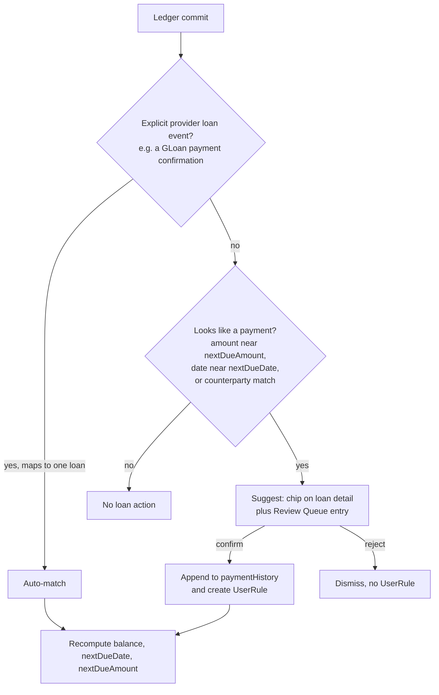

# Loans

This document specifies loan tracking in both directions — money the user owes (GLoan, credit cards, Home Credit installments, 5-6, personal utang) and money owed to the user (personal lending) — including schedule types (amortized, flat, free-form), the full amortization schedule (Plus), payment matching from the ledger, manual payment recording, due reminders, and the special handling informal 5-6 loans need.

**Status:** Draft v1 · 2026-08-02

## Purpose

Utang (debt, in the everyday Filipino sense of both formal loans and personal IOUs) is a fact of Philippine financial life: app-based loans like GLoan, store installments like Home Credit, credit cards, informal 5-6 street lending, and the constant low-level ledger of lending to and borrowing from family and friends. PeraPlano tracks all of it in one place with the same promise as the rest of the app — you set the rules once, and payments are picked up from the ledger automatically wherever notifications reveal them. Every Loan answers three questions: how much is still outstanding, when is the next payment due and how much, and (on Plus, for scheduled loans) what does the full payoff path look like. The app records and reminds; it never moves money and never contacts a counterparty.

## User stories

- As a GLoan borrower, I want my monthly GLoan payment picked up automatically from the GCash notification, so that my outstanding balance stays current without any logging.
- As a Home Credit customer, I want to enter my 12-month installment plan once and see the full payment schedule, so that I know exactly what is left after every payment.
- As a credit card holder, I want a reminder 3 days before my card's due date and an easy way to mark the statement paid, so that I never eat a late fee.
- As a 5-6 borrower, I want to record what I borrowed and the total I agreed to pay back — with no interest formula forced on me — and log the collector's irregular visits as they happen, so that the app matches how 5-6 actually works.
- As someone lending to friends, I want an "owed to me" list per person, so that I stop keeping utang lists in my head or in chat threads.
- As a lender, I want incoming GCash transfers from a borrower suggested as loan payments, so that repayments reconcile in one tap.
- As a cash payer, I want to record a payment by hand when there is no notification trail, so that my loan balance is right even for cash.
- As a free user, I want at least basic tracking — balance and next due — on my one loan, so that the app is useful before I ever pay for Plus.

## UX states & flows

### States

| State | Description |
|---|---|
| Empty | No loans. Empty state explains both directions with one Add loan action. |
| List | Plan tab → Loans, grouped **I owe** and **Owed to me**. Each row: `counterparty`, outstanding balance, `nextDueDate` + `nextDueAmount` (when set). Overdue rows carry an attention badge. |
| Detail (Free) | Balance, next due, payment history, reminders, record-payment action. |
| Detail (Plus) | Everything in Free, plus the full amortization schedule table for scheduled loans: each installment's date, amount, principal/interest split (amortized type), and paid/unpaid status. |
| Suggested payment | A ledger Transaction looks like a payment for this loan: a suggestion chip on the loan detail and an entry in the Review Queue await one-tap confirmation. |
| Overdue | `nextDueDate` passed without a matched or recorded payment. |
| Settled | Balance ₱0.00. Loan moves to a settled list; history retained. |
| Gated | Free user at the loans cap, or opening the amortization schedule view. See Free vs Plus. |

### Flow: add a loan

1. Plan tab → Loans → Add loan.
2. Choose `direction`: I owe / Owed to me. Enter `counterparty` (person or provider name) and `principal`.
3. Choose the schedule type (see Rule 1):
   - **Amortized** — enter `interestRate` (with an explicit per-month or per-annum unit), term, and payment cadence; the app computes the installment and full schedule, shown as a preview before saving.
   - **Flat** — enter the total amount to repay (e.g., borrowed ₱5,000.00, repay ₱6,000.00) and the installment amount and cadence; no interest math is applied.
   - **Free-form** — no schedule; optionally set `nextDueDate` and `nextDueAmount` by hand.
4. Optionally set `linkedWalletId` (e.g., the credit-type Wallet for a credit card, or the Wallet payments usually leave from) to sharpen payment matching.
5. Set reminders (defaults per Rule 15) and save.

### Flow: automatic payment matching from the ledger

1. After a Transaction commits to the ledger, the matcher scores it against open loans (signals in Rule 8).
2. Explicit provider loan events (e.g., a GLoan payment confirmation from the provider catalogue in [../03-ingest-pipeline.md](../03-ingest-pipeline.md)) that map unambiguously to a single loan auto-match.
3. Everything else becomes a suggestion — never a silent commit. The user confirms or rejects from the loan detail or the Review Queue (see [08-review-queue.md](08-review-queue.md)).
4. A confirmed match creates a UserRule (e.g., "transfers to JUAN D → payment on loan Juan-utang"), so the next payment from the same trail matches with higher confidence.

### Flow: manual payment recording

1. Loan detail → Record payment. Enter amount and date; pick the paying Wallet (typically cash).
2. The app creates a `source: manual` Transaction in that Wallet (direction `out` for I-owe, `in` for owed-to-me), categorized Utang & Loan Payments, and appends it to `paymentHistory[]`.
3. If the money never touched a tracked Wallet (e.g., a relative paid the collector directly), the user records a **balance adjustment** instead: the loan balance changes with a note, and no Transaction is created (Rule 13).

### Flow: reminder → payment

1. A reminder fires per the loan's offsets. *Illustrative:* "GLoan ₱2,450.00 due on the 15th — that's in 3 days."
2. Tapping opens the loan detail. If a candidate Transaction already exists, the suggestion is front and center; otherwise the user pays in their banking app and lets matching catch it, or records it manually.
3. When the due amount is covered, `nextDueDate` and `nextDueAmount` advance (Rule 11) and the overdue state clears.

### Flow: 5-6 informal loan

1. Add loan → I owe → counterparty "Aling Nena" → `principal` ₱5,000.00 → Flat → total repayable ₱6,000.00 → cadence "irregular" (or daily/weekly if the collector is regular).
2. No interest formula is shown or computed; the app tracks outstanding = ₱6,000.00 minus payments.
3. Collector visits are logged via Record payment (cash Wallet, two taps from the loan card). The user may edit `nextDueDate` freely at any time — skipped weeks carry no penalty math.

## Rules & edge cases

1. **Schedule types.** `schedule?` is one of: **amortized** (computed from `principal`, `interestRate`, term, cadence — declining-balance installment math with a per-installment principal/interest split), **flat** (user-entered total repayable and installment plan; equal installments; no interest computation), or **free-form** (no schedule; `nextDueDate`/`nextDueAmount` optional and user-managed). All three are available in both directions.
2. **Outstanding balance.** Amortized: remaining balance per the schedule after applied payments. Flat: total repayable minus the sum of `paymentHistory[]`. Free-form: `principal` (or a user-set starting balance) minus payments, plus any balance adjustments.
3. `interestRate?` is optional and used only by the amortized type. It is entered with an explicit per-month or per-annum unit — PH consumer lenders commonly quote monthly add-on rates, and a silently misread unit would corrupt every number downstream.
4. **5-6 never gets an interest formula.** 5-6 (informal street lending — borrow ₱5, repay ₱6, an implied flat 20% add-on, collected on whatever schedule the collector keeps) is modeled as flat or free-form only. The app never derives or displays an interest rate for it, and irregular cadence means: no schedule table, no missed-payment math, reminders only if the user sets a `nextDueDate`.
5. Credit cards are tracked as free-form loans, typically with `linkedWalletId` pointing at the credit-type Wallet. `nextDueAmount` is the user's choice (statement balance, minimum due, or a planned amount) and `nextDueDate` is the statement due date. The credit Wallet keeps tracking card spending independently; the Loan tracks the payable and its due date.
6. A payment from one tracked Wallet to another tracked Wallet (e.g., BPI → own credit card Wallet) is detected as a Transfer Link. The out-leg Transaction is still valid as a loan payment and is referenced in `paymentHistory[]`, while remaining excluded from spend and income totals per domain invariant 2 (see [../02-domain-model.md](../02-domain-model.md)). Loan accounting and spend totals never double-count.
7. Every `paymentHistory[]` entry references either a ledger Transaction (matched or manually created) or a balance adjustment (Rule 13). There are no free-floating payment records.
8. **Matching signals**, in descending weight: (a) explicit provider loan events (e.g., GLoan payment confirmation); (b) an existing UserRule from a prior confirmation; (c) `counterparty` matching the Transaction `merchant` or parsed recipient; (d) amount within ±2% of `nextDueAmount`; (e) timestamp within 7 days of `nextDueDate`; (f) the Transaction's Wallet matching `linkedWalletId`.
9. Only signal (a), with an unambiguous single-loan mapping, may auto-match. Every other combination produces a suggestion requiring confirmation. If two or more open loans are plausible for one Transaction, it is always a suggestion listing the candidates — never an auto-match.
10. Rejecting a suggestion never creates a negative UserRule automatically; repeated rejections for the same merchant surface a one-time "stop suggesting this merchant for this loan?" prompt.
11. **Advancing the due.** When payments covering `nextDueAmount` are applied: amortized and flat loans advance `nextDueDate` by the cadence and set `nextDueAmount` to the next installment; a partial payment reduces the outstanding `nextDueAmount` remainder without advancing the date; an overpayment applies the excess to the balance. Free-form loans reduce the balance and leave `nextDueDate`/`nextDueAmount` for the user (with an inline nudge to update them).
12. Overdue: `nextDueDate` passes without full coverage → overdue state on the loan row and card, plus the follow-up reminder in Rule 15. The app never applies penalties or late fees on its own; if the lender charges one, the user records it as a balance adjustment.
13. **Balance adjustments** cover reality the app cannot see: accrued interest or fees on free-form loans, lender-side corrections, penalties, or payments made entirely outside tracked money. Each adjustment carries an amount, a date, and a required note, and appears in the loan's history clearly marked as an adjustment, not a payment.
14. For amortized loans, an extra payment beyond the installment recomputes the remaining schedule with the same installment amount and a shorter term. (Whether to offer "reduce installment, keep term" as an option is an open question below.)
15. **Reminders.** Defaults per loan: 3 days before `nextDueDate`, on the due date, and 3 days after if still unpaid. Offsets are adjustable per loan, and reminders can be turned off entirely (many 5-6 borrowers do not want a due-date reminder for a collector who simply shows up). Reminders use the app's own notifications, which on Android 13+ require the POST_NOTIFICATIONS runtime permission; if it is denied, due states still appear in-app. All reminder texts shown in this document are illustrative.
16. Reminders are available on both tiers — the free tier's "balance + next due" tracking includes being reminded of that next due.
17. Owed-to-me repayments are `direction: in` Transactions matched with the same signals (Rule 8). Transactions matched to an owed-to-me loan are excluded from income cadence detection so that a borrower's regular repayments are never mistaken for a payday (see [04-income.md](04-income.md)).
18. Payments on I-owe loans default to the Utang & Loan Payments category; a confirmed match applies it if the Transaction was Uncategorized, and never overwrites a category the user set by hand.
19. Loan dues do not enter the Safe-to-Spend formula directly (its terms are limits, bills, and planned goal contributions — see [09-safe-to-spend.md](09-safe-to-spend.md)). A user who wants a recurring loan payment reflected ahead of time can create a Bill for it ([07-bills.md](07-bills.md)); since the Bill's auto-match and the loan's payment matching can link the same paying Transaction, this stays consistent — but see Open question 1.
20. Settled loans (balance ₱0.00) keep their full `paymentHistory[]` and remain viewable in the settled list. A settled loan can be reopened by a balance adjustment (e.g., a late-arriving fee).
21. Deleting a loan removes the Loan and its `paymentHistory[]` records but never touches the referenced ledger Transactions (they simply lose their loan association). A confirmation states exactly this.
22. Deleting or reassigning a Wallet follows domain invariant 4 and does not invalidate a loan; `linkedWalletId` is cleared if its Wallet is deleted, and matching falls back to the remaining signals.
23. Counterparties are plain names on the Loan; the app never messages, notifies, or otherwise contacts a counterparty, and owed-to-me records are visible only to the user.
24. History caveat: on the free tier, ledger history is 90 days, but Loan records and `paymentHistory[]` entries are not ledger history — a payment recorded 6 months ago still shows in the loan's history even when its underlying Transaction has aged out of the free ledger view.
25. Tier gates follow the global principle: keep data, block creation of new, never delete (see Free vs Plus below).

## Data touched

| Entity | Access | Notes |
|---|---|---|
| Loan | Read/write | Full lifecycle: `direction`, `counterparty`, `principal`, `interestRate?`, `schedule?`, `linkedWalletId?`, `paymentHistory[]`, `nextDueDate`, `nextDueAmount`. |
| Transaction | Read; write for manual payments | Reads committed Transactions for matching; manual recording creates `source: manual` Transactions. |
| TransferLink | Read | Transfer-linked out-legs can be loan payments (Rule 6). |
| Wallet | Read | `linkedWalletId` and paying-Wallet selection; credit-type Wallet interplay (Rule 5). |
| UserRule | Write | Confirmed matches create replayable rules; read back as matching signal (b). |
| Category | Read | Utang & Loan Payments default categorization (Rule 18). |
| Bill | Cross-reference only | Optional user-created Bill for a recurring loan due (Rule 19); no direct writes from this feature. |
| Entitlements | Read | Evaluated at loan creation and at the amortization schedule view. |

## Free vs Plus

Relevant row of the tier matrix (see [../05-monetization.md](../05-monetization.md) for the full matrix):

| Capability | Free | Plus |
|---|---|---|
| Loans | 1, basic tracking (balance + next due) | Unlimited + full amortization schedule |

Behavior at the gate — always keep data, block creation of new, never delete:

- A free user with 1 loan who taps Add loan sees the upgrade sheet; the existing loan is untouched.
- Free basic tracking includes: outstanding balance, `nextDueDate` + `nextDueAmount`, payment matching and manual recording, payment history, and reminders. The full amortization schedule table (per-installment breakdown and principal/interest split) is the Plus depth: free users creating an amortized loan still get correct balance and next-due figures, with the schedule view shown locked behind an upgrade prompt.
- On downgrade from Plus: all loans remain tracked — balances update, payments match, reminders fire — for every existing loan. Creating new loans is blocked while over the cap, and amortization schedule views lock (the data is retained and reappears on upgrade).

## Acceptance criteria

- [ ] Loans can be created in both directions with each schedule type: amortized (with computed installment preview), flat (user-entered total repayable), and free-form.
- [ ] For a known amortized input set (principal, rate, unit, term, cadence), the computed installment and full schedule match reference figures, and the per-installment principal/interest split is shown on Plus.
- [ ] A parsed GLoan payment confirmation auto-matches to the corresponding loan and updates balance, `nextDueDate`, and `nextDueAmount` with no user action.
- [ ] A Transaction within ±2% of `nextDueAmount` and within 7 days of `nextDueDate` produces a suggestion on the loan and in the Review Queue — and does not auto-commit.
- [ ] Confirming a suggestion appends to `paymentHistory[]`, recomputes the loan, and creates a UserRule; the next matching payment scores higher.
- [ ] When two open loans both plausibly match one Transaction, the user is shown a candidate choice; nothing auto-matches.
- [ ] Manual payment recording creates a `source: manual` Transaction in the chosen Wallet, categorized Utang & Loan Payments, and a linked `paymentHistory[]` entry.
- [ ] A payment between two tracked Wallets that forms a Transfer Link still records as a loan payment and is excluded from spend totals.
- [ ] Partial payments reduce the outstanding `nextDueAmount` without advancing the date; full coverage advances the schedule; overpayment reduces the balance.
- [ ] A 5-6 flat loan shows total repayable minus payments, displays no interest rate anywhere, and accepts irregular manual payments and free `nextDueDate` edits.
- [ ] Reminders fire at 3 days before, on the due date, and 3 days after if unpaid (defaults), are adjustable per loan, and degrade to in-app due states when POST_NOTIFICATIONS is denied.
- [ ] Transactions matched to owed-to-me loans are excluded from income cadence detection.
- [ ] Free tier: creating a second loan is blocked with an upgrade sheet; the amortization schedule view is locked; balance, next due, matching, history, and reminders all still work.
- [ ] Deleting a loan leaves all referenced ledger Transactions intact.

## Open questions

1. Should a loan with a regular schedule be able to feed Safe-to-Spend directly (opt-in per loan), instead of requiring the user to mirror it as a Bill? Direct feeding is less setup but needs a firm double-count guard for users who create both; the mirror-as-Bill answer keeps one pipeline but risks drift when the loan reschedules.
2. For extra payments on amortized loans, the doc defaults to "same installment, shorter term" (Rule 14). Should "smaller installment, same term" be offered as a per-loan choice, and which do PH lenders like Home Credit actually apply to prepayments?
3. Should the app ever show an implied cost figure for flat loans (e.g., "you are paying ₱1,000.00 over principal")? There is financial-literacy value, but for 5-6 users it may read as judgment of an arrangement they had no alternative to — and the number could be mistaken for an official lender figure.
