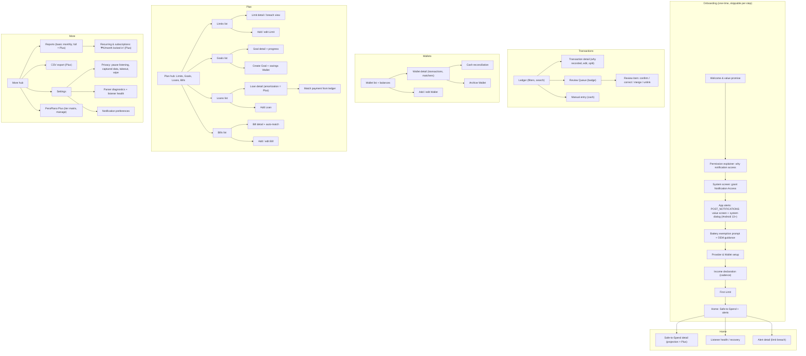

# Information Architecture

This document maps the entire PeraPlano app surface: the five-tab bottom navigation, the full screen map, step-by-step specifications of the critical user flows, the strategy for the app's own notifications (what PeraPlano itself sends the user, and the anti-spam rules that keep a notification-listening app from becoming a notification polluter), and the empty state of every tab. It expands §9 of the master planning context and is the reference for all screen names used across the feature docs in [04-features/](04-features/).

**Status:** Draft v1 · 2026-08-02

---

## 1. Navigation model

Bottom navigation with **5 tabs**, always visible on top-level screens:

| Tab | Contents | Badge |
|---|---|---|
| **Home** | Safe-to-Spend + alerts, listener-health banner, recent activity | None |
| **Transactions** | Ledger + Review Queue | Review Queue count (low-confidence items awaiting confirmation) |
| **Wallets** | Wallet list, balances, cash reconciliation | None |
| **Plan** | Limits, Goals, Loans, Bills (four sections in one hub) | Count of Bills due within 3 days + Loans past due |
| **More** | Reports, export, settings, privacy, PeraPlano Plus | None |

Navigation rules:

1. Tab state is preserved when switching tabs (returning to Transactions restores scroll position and filters).
2. Deep links from the app's own notifications (§6) open the relevant detail screen with back navigation returning to that screen's owning tab, not to Home.
3. The Review Queue badge is the only red-accent badge; the Plan badge uses a neutral accent. Badges show counts up to 99, then "99+".
4. Modal flows (add/edit forms, onboarding) slide over the tab bar; the tab bar is hidden during onboarding only.

## 2. Full screen map

Screen inventory notes:

1. Every screen above is reachable in at most 3 taps from app open (tab → list → detail).
2. "Listener health / recovery" is both a Home banner target and a Settings entry — one screen, two entry points.
3. The Plan hub is one scrollable screen with four sections, each with its own header and "see all" list screen; it is not four separate tabs.
4. Onboarding steps OB2–OB8 are individually skippable; skipping OB3 puts the app in manual mode (see [04-features/01-onboarding.md](04-features/01-onboarding.md)).

## 3. Tab-by-tab specification

### 3.1 Home

The answer to one question: *"Can I spend right now?"*

- **Hero:** the Safe-to-Spend number for today (Lucide `Navigation` icon), floored at ₱0 with a "you're over by ₱X" state when negative (formula and states in [04-features/09-safe-to-spend.md](04-features/09-safe-to-spend.md)). Free tier shows today only; the end-of-period projection area is a Plus surface.
- **Alert strip:** active limit-threshold alerts (50/80/100%), Bills due soon, Loans due — tap-through to detail.
- **Listener-health banner:** appears only when tracking was interrupted ("tracking was interrupted" recovery entry, §4.8) or Notification Access is missing.
- **Recurring summary (Plus):** the "₱X/month locked in" card summarizing acknowledged RecurringPatterns, tapping through to More → Subscriptions, its own screen rather than a Reports section; Free sees a locked preview with the detection count only ([04-features/10-reports.md](04-features/10-reports.md)).
- **Recent activity:** last few committed Transactions with a "see all" link to Transactions.

### 3.2 Transactions

The ledger and its pressure valve.

- **Ledger:** reverse-chronological Transactions, grouped by day, with direction, amount (`₱1,234.56` format), merchant, Wallet, and Category. Filters: date range (90-day visibility cap on free tier), Wallet, Category, direction, source. Transfer-linked pairs display as one internal movement row.
- **Transaction detail:** all fields, the "why did the app record this?" view showing the captured source via `rawNotificationRef` while raw text is retained (30-day TTL), and actions: recategorize, change Wallet, add note, split, create/remove Transfer Link.
- **Review Queue:** badge-counted inbox of low-confidence parses, unknown-provider captures, and ambiguous transfers. One-or-two-tap confirm/correct; every correction becomes a UserRule (triage spec in [04-features/08-review-queue.md](04-features/08-review-queue.md)).
- **Manual entry:** primarily for cash; also the fallback when a provider is unsupported (flow specified in [04-features/02-wallets.md](04-features/02-wallets.md)).

### 3.3 Wallets

- **Wallet list:** cards per Wallet with `name`, `type` (bank / e-wallet / cash / credit / savings), and `balance`; archived Wallets collapsed below.
- **Wallet detail:** transaction list scoped to the Wallet, `matchers[]` management (which notification sources map here), balance history, and — for cash Wallets — the reconciliation entry point (§4.7).
- **Add/edit Wallet:** gated at 3 unarchived Wallets on the free tier (gate behavior in [05-monetization.md](05-monetization.md) §3.2).

### 3.4 Plan

The rules hub — everything the user sets, in one place: Limits, Goals, Loans, Bills. Each section shows its top items with status (Limit headroom, Goal progress, Loan `nextDueDate`/`nextDueAmount`, Bill due countdown) and links to its full list. Feature specs: [04-features/03-limits.md](04-features/03-limits.md), [04-features/05-goals-savings.md](04-features/05-goals-savings.md), [04-features/06-loans.md](04-features/06-loans.md), [04-features/07-bills.md](04-features/07-bills.md).

### 3.5 More

- **Reports:** basic monthly (free); trends, comparisons and custom ranges (Plus). Recurring & subscriptions ("₱X/month locked in") is NOT a section here: it is its own screen at More → Subscriptions. [04-features/10-reports.md](04-features/10-reports.md).
- **Export:** CSV (Plus). Distinct from the never-gated privacy takeout inside Settings.
- **Settings → Privacy:** pause listening (global or per provider), view exactly what was captured, export everything, wipe everything ([04-features/11-settings-privacy.md](04-features/11-settings-privacy.md)).
- **Settings → Diagnostics:** parser diagnostics, listener health, parser-corpus version.
- **Settings → Notification preferences:** per-channel toggles and quiet hours (§6).
- **PeraPlano Plus:** the one full tier-matrix screen; the only non-contextual upgrade surface.

Where gating is referenced anywhere in this document, the canonical matrix applies:

| Capability | Free | Plus |
|---|---|---|
| Auto-tracking (notification ingest) | Unlimited | Unlimited |
| Wallets | 3 | Unlimited |
| Limits | 1 active | Unlimited + per-category |
| Goals | 1 | Unlimited + payday auto-allocate |
| Loans | 1, basic tracking (balance + next due) | Unlimited + full amortization schedule |
| History | 90 days | Unlimited |
| Reports | Basic monthly | Full + trends + custom range |
| Export | — | CSV (PDF later) |
| Cloud backup / multi-device sync | — | ✓ |
| Recurring/subscription detection | — | ✓ |
| Safe-to-Spend | Today only | Projected to end of period |

## 4. Key flows (step-by-step)

### 4.1 Onboarding (install → first auto-tracked transaction, target < 5 minutes)

1. **Welcome:** value promise — "You never log a transaction; you only set the rules." Lucide `Send` mark.
2. **Permission explainer:** *before* any system screen, explain in plain language why Notification Access is needed, what is read, that parsing is on-device, that raw text never leaves the phone and is purged after 30 days. One screen, no scroll walls.
3. **Grant Notification Access:** hand off to the Android system settings screen (a deliberately stern system UI — the explainer exists to pre-empt it). On return, confirm listener status. **Skippable** → manual mode.
4. **App alerts (POST_NOTIFICATIONS, Android 13+):** value screen for the app's own alerts (limit thresholds, bill reminders, the daily Review Queue digest), then the system runtime permission dialog. Skippable; denial keeps every alert available in-app (§6.1). Matches step 4 of [04-features/01-onboarding.md](04-features/01-onboarding.md).
5. **Battery exemption:** request battery-optimization exemption; on aggressive OEM devices (Xiaomi/MIUI, Huawei, Oppo, Vivo) show the OEM-specific guidance screen. Skippable.
6. **Provider & Wallet setup:** show detected/known providers (GCash, Maya, BPI, BDO, etc.); user confirms which they use; a Wallet is created per confirmed provider with `matchers[]` prewired; user can add a cash Wallet.
7. **Income declaration:** pick cadence — kinsenas (the PH norm: payday on the 15th and 30th), weekly, monthly, or irregular — and an average amount, or "detect it for me" (IncomeProfile with `isManualOverride` false).
8. **First Limit:** one suggested monthly Limit (fixed ₱ or % of income). Skippable.
9. **Done → Home**, which now waits for (or already shows) the first ingested Transaction.

Principle: explain value before each scary permission; every permission is skippable; the app degrades to manual mode rather than blocking.

### 4.2 Review Queue triage

1. User opens Transactions → Review Queue (badge shows count).
2. Each item shows the parsed guess (amount, direction, merchant, proposed Wallet/Category) and the captured source text.
3. One-tap **Confirm** commits as-is; **Correct** opens a compact editor (fix Category, Wallet, merchant, or mark "not a transaction").
4. Ambiguous transfer items offer **Merge** (create Transfer Link between the two legs) or **Keep separate**; wrongly linked pairs offer **Unlink**.
5. Unknown-provider captures offer "this is a money notification" → flags the source for future parser coverage.
6. Every correction silently creates a **UserRule** that replays on future notifications; a small confirmation notes "PeraPlano will remember this."
7. Queue empty → "all caught up" state; badge clears.

### 4.3 Add / edit Limit

1. Plan → Limits → **Add Limit** (Entitlements check: free tier, 1 active — see gate matrix above).
2. Choose `scope` (daily / weekly / monthly / annual) and `basis` (fixed ₱ or percent-of-income; percent requires an IncomeProfile and offers to declare one inline).
3. Optional `categoryFilter` / `walletFilter`; toggle `rollover`.
4. Preview: "alerts at 50% / 80% / 100%" with the computed peso thresholds.
5. Save → Limit is active; Safe-to-Spend recomputes immediately.

### 4.4 Create Goal + savings Wallet

1. Plan → Goals → **Create Goal**.
2. Name, `targetAmount`, optional `targetDate`.
3. Link a savings Wallet: pick an existing `type: savings` Wallet or create one inline (counts toward the Wallet cap).
4. Optional `contributionRule` — auto-allocate ₱X or X% on payday (Plus; gated at the toggle).
5. Save → Goal detail shows progress = linked Wallet balance vs `targetAmount`, with pace vs `targetDate` (Lucide `PlaneTakeoff`).

### 4.5 Add Loan + match payment

1. Plan → Loans → **Add Loan**.
2. Choose `direction`: **i-owe** (GLoan, credit card, Home Credit, 5-6 — informal high-interest lending — personal utang, i.e., a debt owed) or **owed-to-me**.
3. Enter `counterparty`, `principal`, optional `interestRate` and `schedule` (amortization view is Plus; free shows balance + next due).
4. Save → Loan detail shows `nextDueDate` / `nextDueAmount`.
5. **Match payment:** from Loan detail, "record a payment" lists candidate ledger Transactions (right direction, near amount/date); user picks one → appended to `paymentHistory[]`, balance and next due recompute. Auto-suggested matches land in the Review Queue when confidence is low.

### 4.6 Limit breach alert → in-app detail

1. Ledger commit trips a threshold (50/80/100%) → the app posts a limit alert (channel rules in §6).
2. Tap → Limit detail / breach view: headroom (or overage), the Transactions that consumed the Limit this period, days remaining.
3. Actions: recategorize a wrongly attributed Transaction (may un-trip the threshold), adjust the Limit, or acknowledge.
4. Acknowledging never silences future thresholds of the same Limit; each threshold fires once per period (§6).

### 4.7 Cash reconciliation

1. Entry: Wallet detail (cash Wallet) → **Reconcile**, or a periodic gentle prompt when cash activity is stale.
2. User enters the peso amount actually in their pocket/drawer.
3. App shows the difference vs the recorded balance and offers: log the gap as one adjustment Transaction (choose Category, default Uncategorized), or backfill specific forgotten expenses manually.
4. Balance now matches reality; reconciliation timestamp shown on the Wallet.

### 4.8 Listener-health recovery ("tracking was interrupted")

1. On app open after an interruption (listener disconnected, OEM kill, access revoked), Home shows the recovery banner.
2. Recovery screen states, in plain language: when tracking stopped, the likely cause, and that transactions during the gap were not captured.
3. Guided fixes: re-grant Notification Access; re-apply battery exemption; OEM-specific steps for the detected manufacturer.
4. Catch-up: per affected Wallet, prompt to reconcile balances (4.7) or manually add missed Transactions.
5. Banner clears only when the listener reports healthy again; Settings → Diagnostics always shows current listener status.

## 5. Empty states (per tab)

Empty states use the Lucide `Send` paper-airplane mark (brand rule) unless noted, one line of guidance, and one primary action. They are calm, not salesy — no upgrade prompts in any empty state.

| Surface | Empty state | Primary action |
|---|---|---|
| Home | Listener healthy, no Transactions yet: "Watching for your first transaction — pay with GCash or your bank as usual." If Notification Access missing: setup card instead. | Finish setup / Add manually |
| Transactions | "Nothing tracked yet. Your transactions will appear here automatically." | Add manual Transaction |
| Transactions → Review Queue | "All caught up." (state, not error) | — |
| Wallets | "Add your first Wallet — GCash, bank, or cash." | Add Wallet |
| Plan → Limits | "Set your first Limit and PeraPlano will watch it for you." | Add Limit |
| Plan → Goals | `PlaneTakeoff` icon: "Saving for something? Give it a name." | Create Goal |
| Plan → Loans | "Track utang both ways — what you owe and what's owed to you." | Add Loan |
| Plan → Bills | "Add a Bill and get reminded before it's due." | Add Bill |
| More → Reports | "Reports build up as your data does — check back after a few days of tracking." | View Transactions |

Empty-state rules:

1. An empty state never blocks navigation; all creation paths remain reachable.
2. Home's empty state doubles as the listener status surface — it must never claim "all good" while the listener is unhealthy.
3. Empty states are distinct from error states (error states are specified per feature doc).

## 6. The app's own notifications

PeraPlano reads notifications for a living — so its own must be few, timely, and each one worth a tap. All notification copy below is **illustrative**, not final.

### 6.1 Channels

Each type is a separate Android notification channel, so the user can mute any type at the system level; the same toggles appear in Settings → Notification preferences. POST_NOTIFICATIONS is a runtime permission on Android 13+; if the user declines it, every item below appears as an in-app Home alert instead — nothing is lost, only the push.

| Channel | Trigger | Default importance | Illustrative text |
|---|---|---|---|
| Limit alerts | An active Limit crosses 50% / 80% / 100% at ledger commit | High at 100%, default below | "Food & Dining: ₱4,000.00 of ₱5,000.00 used (80%) — 9 days left this month." |
| Bill reminders | A Bill's `reminderOffsets[]` (e.g., 3 days before, on due date), plus the overdue escalation in [04-features/07-bills.md](04-features/07-bills.md) rule 22 | Default | "Meralco is due on the 20th — about ₱2,100.00." |
| Loan reminders | A Loan's `nextDueDate` approaches or passes, per its offsets (default 3 days before, on due date, 3 days after if unpaid — [04-features/06-loans.md](04-features/06-loans.md) rule 15) | Default | "GLoan ₱2,450.00 due on the 15th — that's in 3 days." |
| Goal updates | A Goal milestone first crossed (25/50/75/100%, once each per goal lifetime) or a Plus payday allocation prompt ([04-features/05-goals-savings.md](04-features/05-goals-savings.md) rules 12, 14) | Default | "Halfway there! ₱25,000.00 of ₱50,000.00 saved for Emergency Fund." |
| Review Queue digest | Optional daily digest, at most once per day, only when the queue has ≥5 actionable items or any item nears expiry ([04-features/08-review-queue.md](04-features/08-review-queue.md) rule 20); never per-item pushes | Default (digest **on** by default, 7:00 PM) | "6 transactions are waiting for a quick review." |
| Listener health | Listener dead/disconnected beyond a short grace window, or access revoked | High | "PeraPlano stopped receiving notifications. Tap to fix tracking." |
| Payday summary | Income detected per IncomeProfile cadence (e.g., kinsenas: the 15th and 30th) | Default, **opt-in** | "Payday! ₱18,000.00 received. Safe-to-Spend is ready — plan your kinsenas." |

This table is the canonical channel list; [07-privacy-and-compliance.md](07-privacy-and-compliance.md) §3.5 and the Alerts toggles in [04-features/11-settings-privacy.md](04-features/11-settings-privacy.md) mirror it exactly.

Deep links: Limit alerts → Limit breach view (4.6); Bill reminders → Bill detail; Loan reminders → Loan detail; Goal updates → Goal detail; Review Queue digest → Review Queue; Listener health → recovery screen (4.8); Payday summary → Home.

### 6.2 Anti-spam rules

1. Each Limit threshold (50/80/100%) fires **at most once per Limit per period**. Crossing back down and up again does not re-fire.
2. If multiple thresholds are crossed by a single Transaction, only the highest fires (100% supersedes 80%).
3. Bill reminders fire only on configured `reminderOffsets[]` — never a daily nag; overdue notices follow the Bills escalation ([04-features/07-bills.md](04-features/07-bills.md) rule 22): one on day +1, then one every 3 days, maximum 3 per cycle, after which the overdue Bill surfaces in-app only.
4. Listener-health warnings: at most one per distinct interruption, and no more than one per day even across repeated interruptions on unstable devices.
5. Payday summary is opt-in and fires at most once per detected payday.
6. Global coalescing: if more than 3 notifications would post within a few minutes (e.g., catch-up after reconnecting), they collapse into one summary notification ("3 updates while you were away").
7. Quiet hours (default 21:00–08:00, user-adjustable): everything except listener-health warnings is held and delivered after quiet hours end; 100% limit breaches are delivered at the start of the next morning, not dropped.
8. **No marketing, ever.** Upgrade prompts, feature announcements, and re-engagement pushes are prohibited on all channels; Plus surfaces exist in-app only ([05-monetization.md](05-monetization.md) §5).
9. Review Queue items badge the Transactions tab and never push per item — a deliberate choice, since queue items are by definition low-urgency. The single exception is the optional daily Review Queue digest (at most once per day, trigger conditions and default in [04-features/08-review-queue.md](04-features/08-review-queue.md) rule 20).
10. Notification content never includes raw captured notification text — only PeraPlano's own structured summaries.

## 7. Open questions

1. Whether the Plan tab badge (Bills due + Loans past due) causes badge fatigue alongside the Review Queue badge — validate in beta; fallback is in-section indicators only.
2. Whether Home should offer a one-tap "quick add cash expense" action permanently or only while a cash Wallet exists — leaning toward the latter; confirm with early usability sessions.
3. Exact quiet-hours default (21:00–08:00 proposed) against PH usage patterns (late-night e-wallet activity is common) — tune with beta telemetry (aggregate delivery-time counts only, no content).
